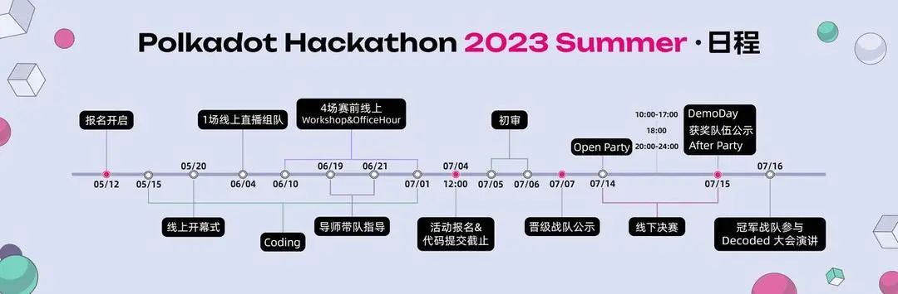
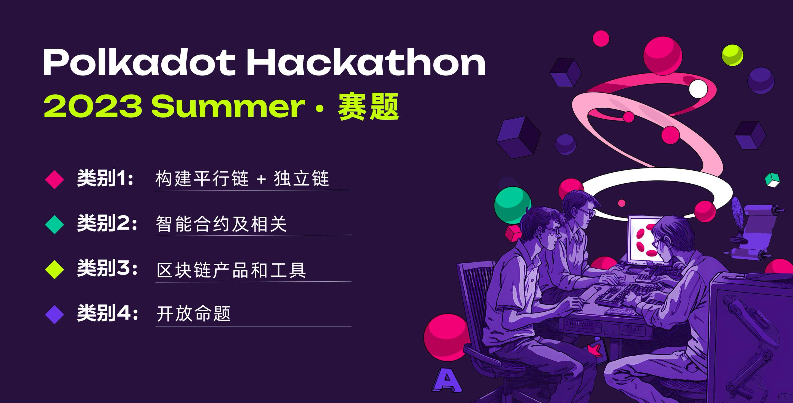

# hackathon-2023-summer


## 时间点



- 活动报名开启：2023年 5月 12日
- 线上 Coding 初赛：2023年 5月 15日 - 2023年 7月 4日
- 开幕式：2023年 5月 20日
- 1场线上直播组队：2023年 6月 3日
- 4场线上 Workshop & Office Hour：2023年 6月 10日 - 2023年 7月 1日
- 导师带队：2023年 6月 19日 - 2023年 6月 21日
- 活动报名截止&代码提交截止：2023年7 月 4日 上午 11:59
- 初选审核：2023年 7月 5日 - 2023年 7月 6日
- 晋级战队公示：2023年7 月 7日
- 线下Hacking决赛：2023年 7月 14日 - 2023年 7月 15日
- DemoDay：2023年 7月 15日 10:00 - 12:00， 14:00 - 17:00
- 获奖队伍公示：2023年 7月 15日 18:00
- Open Party：2023年 7月 14日 20:00 - 24:00
- After Party：2023年 7月 15日 20:00 - 24:00
- 冠军团队参加 Decoded 大会演讲：2023年 7月 16日

## 地点

上海

## 奖项设置



按照项目分成四个不同的赛道，每个赛道由一二三等奖，各一个。其余4个奖项分别为：最受评委喜爱奖、最受开发者喜爱奖、最佳创新奖、Travel Grant奖金池。一共16个奖项。四个赛道分别是:
- 平行链 + 独立链
- 智能合约 (及相关)
- 区块链产品和工具
- 开放命题

[这里有赛道详情](./docs/categories.md)

**项目可以选择多个赛道参赛，初审评审会根据项目实现的功能确定是否可以参与到单个赛道的角逐**

Bounty奖项列表

## 奖金

16个奖项共申请国库30万美金等额的DOT共42,852。每个奖项的金额如下
- 一等奖: 5714 DOT 约四万美金 (每个赛道各一个)
- 二等奖: 2857 DOT 约二万美金 (每个赛道各一个)
- 三等奖: 1428 DOT 约一万美金 (每个赛道各一个)
- 最受观众喜爱奖: 714 DOT 约五千美金 （共一个）
- 最受开发者喜爱奖: 714 DOT 约五千美金 （共一个）
- 最佳创新奖: 714 DOT 约五千美金 （共一个）
- Travel Grant奖金池: 714 DOT 约5000美金 （共一个）
（打卡每场活动+进入决赛来现场的战队共同瓜分该奖金池）

## 项目报名

以下信息也可见于[这微信页](https://mp.weixin.qq.com/s/KGkTkcRh7dO1UmB8REKMtw)。

### 1. 填写谷歌表单

参赛者可以通过以下链接提交报名完善信息，无论您是团队还是个人参赛，每个参赛队员都需要填写此表。

🚩谷歌表单：https://forms.gle/bfQCm1JUKDwBqXSW9

### 2. 填写注册信息

参赛者通过报名链接填写信息，提交电子邮件进行注册。在 Dorahacks 网站上点击“立即注册”按钮，申请一个免费的 Dorahacks 帐户用于参加黑客松。每队至少应有一名队员报名并填写所需信息，可以选择只填写注册所需的信息。参加本次黑客松即表示同意赞助商收集和保存参赛者个人信息，用于运营和宣传黑客松。

🚩报名链接: https://dorahacks.io/hackathon/polkadot-hackathon-2023-summer/detail


### 3. 加入微信群/Discord 群

国内报名选手在提交报名表后，请尽快添加小助手 Emma（oneblockEmma）微信，我们将于 24 小时内给予回复，请耐心等待！我们将会邀请您加入大赛官方“2023 夏季波卡黑客松大赛群”，关于黑客松赛事的信息将会在第一时间内在群内通知！入群后，请将您的群昵称修改为“姓名-XX 团队”或“姓名-个人”（如尚未组队）。如果您遇到任何有关黑客松的问题，也可以私聊 Emma 寻求帮助。


海外参赛选手请加入 Discord 群并选择 **2023 Polkadot Summer Hackathon Hacker** 作为您的角色，请将您的用户名修改为“姓名- xx团队”或“姓名-个人”(如果您尚未组建团队)。

🚩Discord 社群链接：https://discord.com/invite/KsCEKvqU4p

### 4. 创建你的 2023 夏季波卡黑客松大赛项目

1. 报名注册完成后，可以立即开始项目创建，fork 本代码仓库，到你们团队成员 repo 里: https://github.com/parity-asia/hackathon-2023-summer

2. 先在 `projects` 内生成一个目录，以你们项目名称命名，里面先放个空档案，或 readme 简单介绍项目。提交一个 PR 进来。目的是预留一个目录作为你们项目空间。**注意我们会把目录改名，在项目名称前加个编号。请 pull 下来。**

3. 之后，所有参赛项目相关代码都放在你们的项目名称里的目录里进行。可以这种形式存放：

    ```
    projects
      L 00-项目模板/           // 项目目录名称
        L src/
          L substrate/       // substrate 相关代码
          L ui/              // 前端相关代码
          L 。。。            // 其他档案
        L docs/              // 存放文档。视频和PPT等大文件不要直接上传，放链接地址即可
        L README.md
    ```

4. 2023年7月4日上午11:59前，提交最终 PR 进来本 repo，项目只可修改他们目录里的档案。

### 5. 提交初审材料

1. 项目代码必须在 Github 提交 PR 到本 repo ([**parity-asia** 组织](https://github.com/parity-asia) 下的)。在注册的第一周，项目应该复制这个代码存储库并创建一个项目目录。在 README 文件中，列出计划在黑客马拉松期间完成的代码功能(不超过 1000 字)，并向 Parity Github 提交 pull request (PR);

2. 每个项目必须提交至少一件参赛作品，所有项目必须提交英文版本的作品。

3. 参赛作品的内容包括但不限于：

**基本信息**：项目名称、立项日期

**报名赛道**：如需要，可多选

**项目概况**：项目背景/起源/需要解决问题/项目介绍/项目演示/技术架构/项目 Logo /项目初审版本/团队信息/所属赛道

**黑客松期间计划完成的代码项目**：区块链端、Web 端、用户注册页面等

**黑客松完成项目**(2023 年 7 月 4 日上午 11:59 初审前提交)

4. Demo 视频及过大的 PPT 不要上传 Github，可以把链接地址加到 readme。或者将 Demo 视频上传到 YouTube，PPT 链接上传到 Google drive，GitHub 只提交 YouTube 链接和 Google drive 链接。

5. 列出在 2023 年 7 月 4 日上午 11:59 截止日期前，该项目在黑客松期间最终完成的功能。将相关代码放在 “src” 目录中，并在此部分列出已完成的开发工作/特性。我们将重点关注这些目录/文件，并作出技术评估。

6. 如果你想参考一些资料，可以[点击链接查看](https://github.com/parity-asia/hackathon-2023-summer/tree/main/teams/00-team-template)。

7. 参赛作品必须在规定时间内(7 月 4 日中午 12:00 前)提交，超时提交无效

8. 7 月 7 日晚，本次 repo 将给出初步名单，并选出参赛队伍进入 DemoDay

## 导师团队指导参赛项目

比赛过程中，主办方会组织每个参赛战队的线上讨论会议。会议结束后，Parity 工程师与投资机构研究员将作为导师进入战队群并提供指导，参赛团队根据自身项目进展和技术架构提出遇到的开发难题及需求，导师将会为战队提供实质性建议，帮助战队顺利孵化参赛作品！

**如要匹配导师，请尽早提交项目计划，然后联络我们有此需求**。导师资源有限，我们按项目详细度匹配，不保证每队提有导师需求的团队都获得匹配。

## 评审规则

最终初选截止日前提交代码，把相关代码放在 `src` 目录里，并在本栏列出在黑客松期间已完成的开发工作/功能点。我们将对这些目录/档案作重点技术评审。

### 初审 50%:（技术维度）

初审时，参赛作品从下面三个维度进行评分:

- 完成度 (20%): 项目实现完备，不止是概念，Demo / POC 展示完整；项目技术架构、算法实现优雅程度、具备自动单元测试；
- 技术难度 (20%): 解决的问题有一定技术门槛，技术层面具有一定突破。着重：链 runtime / 智能合约开发，其他：前/后端开发；
- 规范性 (10%): 项目在规定的时间提交且内容规范。

### 决赛 50%:（商业维度)

决赛时，从下面三个维度评分:

- 商业价值 (20%): 能解决问题，创新性，能放在你所知的行业场景中使用，以及当前项目发展的进度；立意新颖，具备突破性，打破常规思维。
- 创新性 (20%): 立意新颖，具备突破性，打破常规思维。
- 用户体验 (10%): 包括提交的方案对潜在用户来说的直观性和可理解程度。

**最终每队分数： 技术评审 (50%) + 商业评审 (50%)**

### 备注

- 建议团队保持代码的更新，和提交。提交历史记录清晰的项目更有利与评审了解项目的实际开发工作。
- 全新的项目可以直接从黑客松的 github 开始开发项目，成熟团队写清楚黑客松期间要增加的功能，并在5月12后拉出新branch比如（hackathon-2023-summer）来提交代码。注明branch名称，方便评审了解其工作。
- 参赛团队须通过现场路演汇报的形式，全方位阐述作品实现过程及最终作品。
- 参赛队伍提交的所有参赛资料的知识产权归参赛队伍所有，参赛资料仅用于本次大赛评奖与宣发。
- 初审的结果用来选择参加Demo的团队
- 技术得分会结合 Demo 和问题答辩做调整，Demo 的内容和实现的代码功能应该一致
- **本次活动的最终解释权归 OneBlock 及 Parity 官方所有。**

## Workshop 及 Office Hour 时间表

- 开幕式：2023年5月20日
  1. 2023上半年波卡最新进展 - 周俊 - Parity 工程师
  2. 2023夏季黑客松赛事规则详解 - Jimmy - Substrate 贡献者

    加入方式: Twitter Space https://twitter.com/i/spaces/1zqKVPaELeLJB

- Workshop#1：2023年6月10日20:00 - 21:30
  1. 如何在区块链领域构建去中心的生态 Kaichao Parity 工程师
  2. 创新思维: 探索Web3领域的非传统应用 Jimmy Substrate 贡献者
- Workshop#2：2023年6月19日20:00 - 21:30
  
- Workshop#3：
- Workshop#4：

## 联络

对黑客松有任何疑问，可以下方法联系我们:

* [Github 讨论区](https://github.com/ParityAsia/hackathon-2023-summer/discussions)

* email: hackathon.asia@parity.io

* wechat: oneblockEmma

* [黑客松比赛 Discord](https://discord.gg/KsCEKvqU4p)

## 其他

- [技术资源](./docs/technical-resources.md)

### 合法合规性

本次黑客松为符合国内法规，我们不会触碰以下任何有关题目

- 和发币 (Initial Coin Offering) 相关。
- 和数字资产交易相关
- 任何币价的讨论 (Decentralized Exchange 主题可讨论技术，不涉及币价)
- 和博彩相关和有博彩成分的游戏
