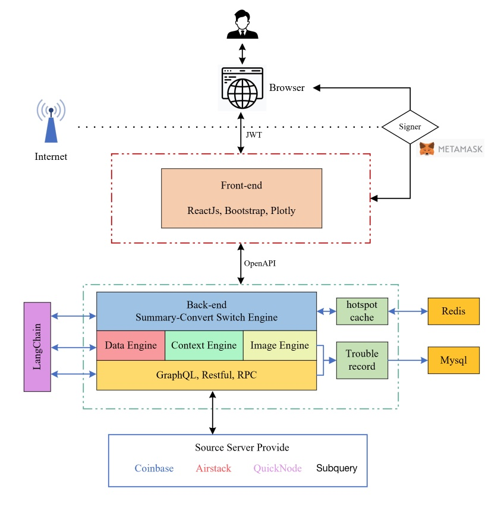

## 基本资料

项目名称：Chatdatainsight

项目立项日期 (哪年哪月)：2023.5

## 项目整体简介
### Background

- In the Web3 industry, data is growing at an unprecedented rate. However, this has also brought some urgent and serious problems: the data explosion has brought about the difficulty of extracting effective and valuable information; technical barriers make it difficult for most people to independently Complete data analysis; difficulties in data retrieval/classification; challenges of on-chain/off-chain data integration. These problems hinder the progress of the industry, and we have the responsibility and ability to solve them.

### Project Description
- Using generative AI as a converter of natural language and query statements, it provides users with advanced data analysis functions through the process of demand-logic-analysis-result generation. Provide people with decision-making aids.

### Demo
- TBD

### Technology Architecture

### Logo

## 黑客松期间计划完成的事项

- 请团队在报名那一周 git clone 这个代码库并创建团队目录，在 readme 里列出黑客松期间内打算完成的代码功能点。并提交 PR 到本代码库。例子如下 (这只是一个 nft 项目的例子，请根据团队项目自身定义具体工作)：

**backend**
  - [ ] Transaction Data Analysis
  - [ ] Polkadot Ecosystem News
  - [ ] Polkadot Token Price Chart

**front end**
  - [ ] Ask and show answer
  - [ ] Support chart display

## 黑客松期间所完成的事项 (2023年7月4日上午11:59初审前提交)

- 2023年7月4日上午11:59前，在本栏列出黑客松期间最终完成的功能点。
- 把相关代码放在 `src` 目录里，并在本栏列出在黑客松期间完成的开发工作及代码结构。我们将对这些目录/档案作重点技术评审。
- Demo 视频，ppt等大文件不要提交。可以在readme中存放它们的链接地址

## 队员信息

**Dylan Lan**
- MANAGEMENT AND TECH
- Serial entrepreneur with experience in web2/3 technologies and AI. PhD in CS, Nordic. Earlier employee in a nordic startup (exit for 60M SEK).
- github: https://github.com/DapengLan

**Harry Liu**
- MANAGEMENT AND TECH
- Senior researcher in a renown Top 500 company. PhD in CS, Nordic.
- github: https://github.com/HITliuyu

**Kai**
- TECH AND OPERATION
- BI expert in a renown Top 500 company. PhD in Data visulization, Nordic. Data analytics consultant company founder.
- github: https://github.com/KahinAkramHassan
- 
**Smith Li**
- Blockchain Developer
- Over 9 years of working experience in various aspects of computer programming.
- Worked in the blockchain industry for 3+ years,  a blockchain development engineer, familiar with polkadot, bitshares, fabric, etc.
- github: https://github.com/baidang201

**yiwei Shi**  
- FULL STACK
- Art and management background, worked for Hearst, MSN, responsible for market and product, more than one year of blockchain development experience, familiar with computer science, cryptography and different economic mechanisms, good at Go and Rust development。Hackathon winner as a team member: Winners of Polkadot Hackathon 2022
- Github : https://github.com/shiyivei
- Email : shiyivei@outlook.com

**Yunfei Li**  
- FRONT END
- Over 8 years of front-end experience,good at vue, react and nodejs，and interested in blockchain and decentralization
- Github: https://github.com/liyunfei22
- Email: liyunfei696@gmail.com

**Youyou Li**
- UI/UX
- Eight years of experience in advertising industry. Provided storyboarding, graphic design, UI design, and other visual content for customers. Worked on projects for Dyson, Sony, Bank of China, Carrefour, Cadillac and other brands. Did graphic and UI design for several web 3 projects out of interest in the area. 
- Github: https://github.com/youyou0921
- Wechat: 18516611762

