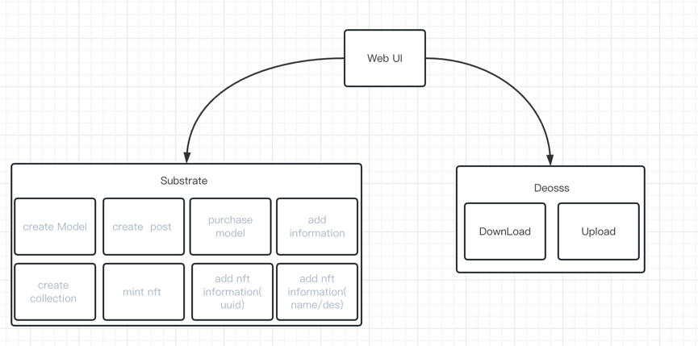
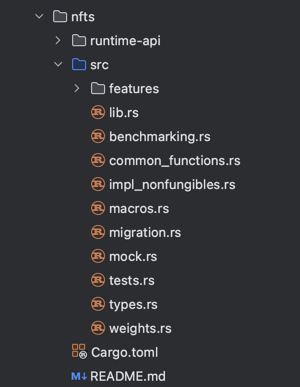
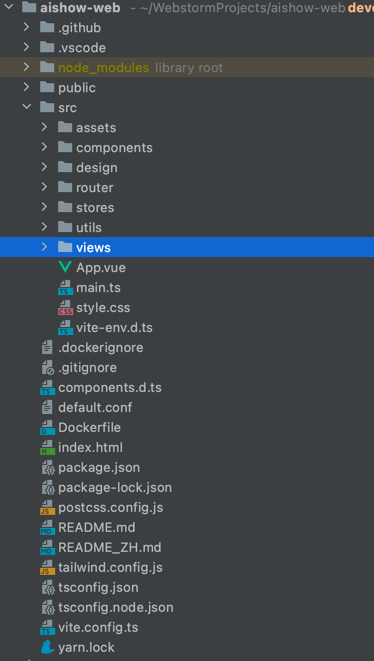

## Basic Information

**Project Name:** AIShow 

**Project Initiation Date:** May 2023

## Project overview
* Background of the project 
  AIShow - Making everyone have their own treasure girl/boy.
  Everyone wants a soulmate, but it is difficult to achieve in real life. But with the hype of Chat GPT, people have realized the capabilities and wide range of applications of AI, coupled with the maturity of blockchain, digital identity and other technologies, this has become possible. We can combine large model training, evolvable digital identity and digital images to generate a soulmate for everyone. So a decentralized AI model sharing and creation platform - AIShow - was born.

* Project introduction  
  AIShow is a decentralized AI model sharing and creation platform where everyone can generate their own treasure girl/boy.
  In AIShow, all data uses distributed storage. Users can publish their own AI models. Creators can create based on their favorite models, and at the same time mint their creative works as NFTs in the market.
  AIShow will also integrate with Chat GPT, introduce evolvable NFT technology, let users train the best companion models and endow them with evolvable digital images.
  Users are not only builders and users, but also beneficiaries. AIShow uses incentive mechanisms and behavior mining. All behaviors that contribute to the platform, such as publishing AI models, creating works, model training, liking and commenting, will be rewarded.  
  Due to the constraints of low TPS, difficult upgrades, and insufficient composability of blockchain applications, taking into account comprehensively, we will use Pokka parallel chain to realize the construction of AIShow platform, and store data on CESS.

* Project information 
  - [Online address](http://54.218.156.194:31899/)
  - [PPT](https://docs.google.com/presentation/d/1o0cvjxWrJW2TcKvCkRJJ3i6cPzArHwSuzTu2AcjwKfg/edit?usp=sharing)
  - [Demo Video](https://youtu.be/otLkfAmr9fo)
  

* Project Architecture 
   

* Project logo  

   
* The initial commitment of the project 
  Blockchain end: 59a21506a26229a52ffcc2d11d878c49ceedb992

* Source code address
  - blockchain end: https://github.com/mohaijiang/forchain-substrate.git
  - web end: https://github.com/mohaijiang/aishow-web.git

## Items planned to be completed during Hackathon

**blockchain end**
- `pallet-forchain`
  - [ ] create Model Information( `fn create_ai_model()` ) 
  - [ ] create a post under the model( `fn create_ai_image()` ) 
  - [ ] purchase model( `fn buy_model()` ) 

- `pallet-nfts`
  - [ ] create a collection (`fn create()`)
  - [ ] add information for collection (`fn set_collection_metadata()`)
  - [ ] mint nft (`fn mint()`)
  - [ ] add nft information(uuid) (`fn set_metadata`)
  - [ ] add nft information(name/des) (`fn set_attribute`)

**client**
- web end
  - [ ] Personal Information Interface
  - [ ] Model display interface
  - [ ] Post Details Screen
  - [ ] Nft Details Screen
  - [ ] Model Upload Page
  - [ ] Post upload interface
  - [ ] NFT Mint page
  - [ ] NFT transactions
  - [ ] Model Download
  - [ ] Nft download

## Items completed during Hackathon

**blockchain end**
- `pallet-forchain`
  - [ ] create Model Information( `fn create_ai_model()` )
  - [ ] create a post under the model( `fn create_ai_image()` )
  - [ ] purchase model( `fn buy_model()` )

- `pallet-nfts`
  - [ ] create a collection (`fn create()`)
  - [ ] add information for collection (`fn set_collection_metadata()`)
  - [ ] mint nft (`fn mint()`)
  - [ ] add nft information(uuid) (`fn set_metadata`)
  - [ ] add nft information(name/des) (`fn set_attribute`)

**client**
- web end
  - [ ] Personal Information Interface
  - [ ] Model display interface
  - [ ] Post Details Screen
  - [ ] Nft Details Screen
  - [ ] Model Upload Page
  - [ ] Post upload interface
  - [ ] NFT Mint page
  - [ ] NFT transactions
  - [ ] Model Download
  - [ ] Nft download

**code structure**

- blockchain end 

   
  

- web end 
  

## Team member information

| Name      | Role                    | GitHub  | WeChat account     |
|-----------|-------------------------|----------------| ----------- |
| LiangTeng | project leader          | ltmuyuan       | ltyuanmu   |
| TT        | product manager         | tdyy555        | ttyoung26   |
| Sun       | developer               | jian-guo-s     | SJG12_3   |
| Abing     | developer               | abing258       | wxid_5rtca6zdqsyn22   |
| Tom       | architecture&full stack | mohaijiang     | wxid_as0r69jy6rn712   |
