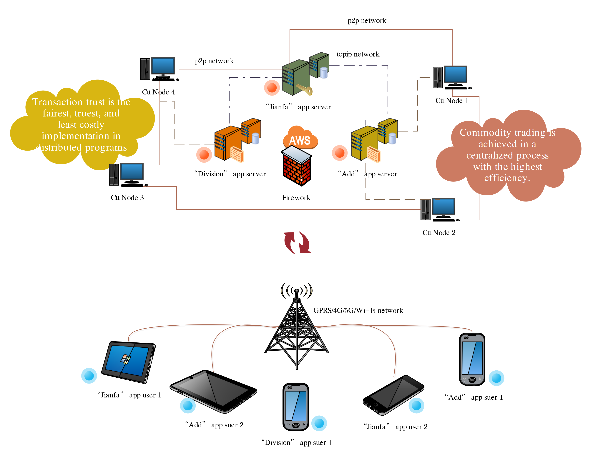

## Notice
06/03/2023
Currently, I plan to develop this project solo, but if there are people who are willing to collaborate on this project together, please feel free to contact me to form a team. my email: support@aigoshop.net

## 基本资料

项目名称：
Trusted Commercial Digital Commune, abbreviated as:“Ctt DC”
项目立项日期 (哪年哪月)：
06/01/2021
## 项目整体简介
The "Trusted" Commercial Digital Commune (Ctt DC) is committed to providing quality assurance and value evaluation services for "transaction" targets on electronic trading platforms that implement the "Trusted" Commercial Transaction Protocol (TCTP). The "transaction" referred to here includes both physical transactions of goods, as well as service transactions such as healthcare, education, finance, or public affairs management. The 'trusted' commercial digital community is one of the core components of the Distributed Business Collaboration System.

The "Trusted" Commercial Digital Commune aims to create a distributed commercial endorsement trust mechanism based on commodity (service) standards and market regulatory regulations, combined with artificial intelligence (AI) algorithms and blockchain community autonomy (DAO). The establishment and operation cost of this trust mechanism is much lower than that of existing centralized commerce; At the same time, trust is genuine and reliable, which can minimize human manipulation.

The purpose of creating a "trustworthy" commercial digital commune is to solve the problem of high transaction trust costs under information asymmetry, allowing producers (service providers) to sell goods (services) locally at a low cost. Producers (service providers) in a distributed business environment do not necessarily rely on commercial advertising, brands, and third-party channels, Instead, it is possible to realize the value of goods (services) in a distributed business environment of decentralized business trust and decentralized business channels without investing sales funds in advance.

The 'trusted' commercial digital community is closely integrated with physical commercial applications. Unlike Bitcoin and Ethereum, their TOKEN value comes from huge commercial profits and can be self virtuous cycle and realized within distributed commercial systems; In addition, as the most important component of the Value Internet, "Trusted" commercial digital communities undertake the innovation of future business, as well as blockchain operation and profit models from 0 to 1.

If a person's wisdom is reflected in their local knowledge, then the greatest wisdom of humanity is to find and discover an order that allows everyone's local knowledge to freely collaborate and expand. This is the ultimate goal pursued by "trustworthy" commercial digital communities.

项目简介，英文提交。包括但不限于：
### What is vision and goal?
1. Establish a business architecture and low-cost business operation scenario that can completely decentralize business trust and channels;
2. Create a blockchain that can be used for trust in physical commercial transactions rather than just data trust, with the core business consensus that the value and quality of goods are in line with consumer interests;
3. Create a crypto world currency based on transaction trust proof-of-work and with underlying business value that can cross sovereign and national boundaries.

The demo version will be based on Stable diffusion.

- 项目背景/原由/要解决的问题 (如有其他附件，可放到 `docs` 目录内。英文提交)
- 
1.Create a networked super department store that is compatible with product standards and market regulatory regulations from various countries, decentralized business trust and channels, and can cross regions or borders for low-cost commercial access;

2.The platform of physical store salespeople empowers them with higher sales efficiency and profitability, maximizing the reduction of business costs for production enterprises!

3.Business reach can rely on a low-cost DAO community ecosystem (recorded through blockchain and confirmed word-of-mouth), without necessarily requiring commercial advertising and traffic.

- 项目介绍
- 
Distributed Business Collaboration System is a business platform that is different from existing business models and forms, consisting of the following two parts:

Part1： "Trusted" Commercial Digital Commune, which is a vertical application blockchain, mainly provides commodity (service) value evaluation and quality assurance services for electronic trading platforms that have implemented the "Trusted" Commercial Transaction Protocol (TCTP protocol).

Part 2：An electronic trading platform that implements the Trusted Commercial Trading Protocol (TCTP). The first product name that has been developed and launched is the "Subtraction" app e-commerce. The electronic trading platform developed based on the Trusted Business Transaction Protocol (TCTP) is typically different from the current "matchmaking" platform. Its core concept is: to mainly transmit the value of goods, supplemented by commercial transactions "matchmaking", and to help manufacturers quickly and conveniently realize the value of goods (services) in a distributed business environment.

Distributed Business Collaboration System is composed of producers, product experts, experiential consumers, product recommenders, and consumers, A "distributed" business collaboration platform composed of IT service providers. Its trust in traded goods (services) is decentralized, that is, goods (services) in a distributed business environment Value evaluation and quality assurance are not determined by the endorsement of a centralized commercial platform, national certification agency, experts, or commercial advertisements, but by the consensus competition among numerous product experts and experiential consumers in the blockchain.

In addition, the Distributed Business Collaboration System also has typical decentralized business channels and low-cost business reach. The ultimate goal of platform construction is to build a low-cost product sales channel and value realization platform for "trusted" product manufacturers. The sales of products in a distributed business environment no longer rely on the sales funds provided by manufacturers, but on whether the product parameters released by manufacturers are true, complete, and trustworthy.

- 项目Demo
-
Ctt DC web wallet: http://www.d2business.net/#/explorer
Android Download：

- 技术架构
- 
The technical architecture of the Distributed Business Collaboration System consists of two parts: a centralized program and a distributed program. We still implement commodity (service) transactions in a centralized program, and blockchain does not participate in the settlement of commodity (service) transactions, but is only a machine for trust and value transmission of commodities (service).

We believe that commodity (service) trading is the most efficient in a centralized platform, while transaction trust is the most fair, reliable, and cost-effective in a distributed program. Once implemented, this commercial platform that balances efficiency, cost, and fairness is highly likely to be the ultimate form of commercial development in human economic and social development.

- 项目 logo (如有)，这 logo 会印制在文宣，会场海报或贴子上。
- 

- 项目的启始的commit
- 

## 黑客松期间计划完成的事项

- 请团队在报名那一周 git clone 这个代码库并创建团队目录，在 readme 里列出黑客松期间内打算完成的代码功能点。并提交 PR 到本代码库。例子如下 (这只是一个 nft 项目的例子，请根据团队项目自身定义具体工作)：

**Blockchain**

Development completed

**Client**

- Embedded app lightweight wallet, development of application related functions
  - [ ] KP Token redemption application, transaction with payment order 
  - [ ] Application License Application Proposal
  - [ ] Application Development and Financing Fund Issuance Proposal
  - [ ] Remote node setup and management
  - [ ] Weighted coefficient of experiential computing power

## 黑客松期间所完成的事项 (2023年7月4日上午11:59初审前提交)

- 2023年7月4日上午11:59前，在本栏列出黑客松期间最终完成的功能点。
- 把相关代码放在 `src` 目录里，并在本栏列出在黑客松期间完成的开发工作及代码结构。我们将对这些目录/档案作重点技术评审。
- 项目文档资料
- 1.项目导介：一种超越现有互联网经济规模的 - 去中心化商业模式
- 2.现代商业信任管理体系的变迁，暨分布式商业协作系统商业信任逻辑、成本分析与算法实现
- 3.分布式商业协作系统宣传彩页（Distributed Business Collaboration System Brochure）
- 4.可信商业数字公社社员告知书v1.0
- 5.Project Introduction - A Decentralized Business Model Beyond the Existing Internet Economy
- 6.The Change of Modern Business Trust Management System and the Implementation of Distributed Business Collaboration System Business Trust Logic, Cost Analysis, and Algorithms
- 7.Trusted Commercial Digital Commune Members Notification v1.0

## 队员信息

xgllln@icloud.com, Product Manager and Project Architecture Design. Kerwin zhu and xiaoyan fen. 