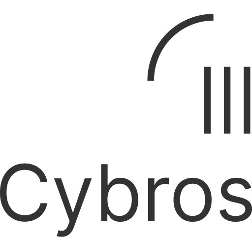

## 基本资料

项目名称：Cybros Network

项目立项日期：6/1/2023

## 项目整体简介

The design of Smart Contracts is for asset-related use cases, not generic computation. To make Web 3 become the natural successor of Web 2, we need to expand the border of Blockchain usage.

There are already a few blockchain networks for domain-specific usages, such as Oracle service, automation service, GPU render service, etc.
Compared with the rich ecosystem of Web 2, it's easy to think that we also need to have push notifications service, post-processing videos or images service, integration with AI service, etc.
Although these scenarios are different, they have such common: they are off-chain computing, latency-insensitive, and require scale on-demand.

Traditional software architecture, especially for Web 2 applications, will use an async jobs scheduler, and developers only need to focus on business logic. A well-designed async jobs scheduler can earn millions of dollars annually, for example, Sidekiq.

If we can work out a Blockchain-based async jobs scheduler, we could introduce tons of classic Web 2 features into the Web 3 world in a native way. Combined with Web 3 composability, it could derive new product forms.
In addition, Blockchain tokenomic could help reduce end-user fees and improve computing power providers' income.

The Blockchain should help manage off-chain job executor nodes, job queues, job lifecycles, scheduling jobs, and ensuring security.

We shall use Substrate to build the blockchain because we want complete control of low-level components to ensure scalability.

## Logo

## 黑客松期间计划完成的事项

**区块链端**

完成区块链功能到可公开 Demo 的程度

- [ ] 整理和清理技术验证原型的代码
- [ ] 调通完整的业务流程

**一个用于展示的用例**

- [ ] 实现链下作业的处理程序
- [ ] 基于网页可演示的 UI

## 黑客松期间所完成的事项

- 完整可用于演示的区块链程序
  - 受 Hackathon 赛期限制，部分功能（如调度器）采用了初步的简单实现
  - 所有实现的功能都是真实可用的，没有 mock 伪造的
- 完整可用于演示的 Job executor
  - 受 Hackathon 赛期限制，整体架构以快速实现为主
  - 包含了 Demo 需要的所有代码
  - 所有实现的功能都是真实可用的，没有 mock 伪造的
- 用于技术评审的参考文档参见 [./docs/README.md](./docs/README.md)
- 一个 dApp 用于演示一种使用场景（AIGC + NFT）

## 队员信息

| 姓名        | 角色         | GitHub 帐号  | 微信账号     |
| ----------- | ----------- | ----------- | ----------- |
| Jun Jiang      | 技术负责人  | jasl   | jasl123   |
| Zhe Wang       | 项目经理   | skysummerice | skysummerice  |
| Jiacheng Zhang | 产品经理   | krhougs  | - |
| Song Wu        | 开发        | wsof401 | -   |
| Zhaoming Pan   | 开发        | RandyPen | -   |
