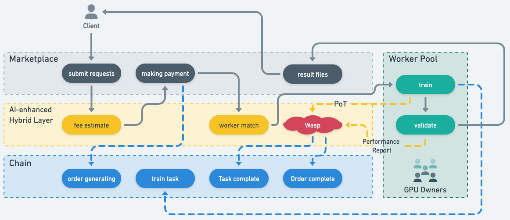
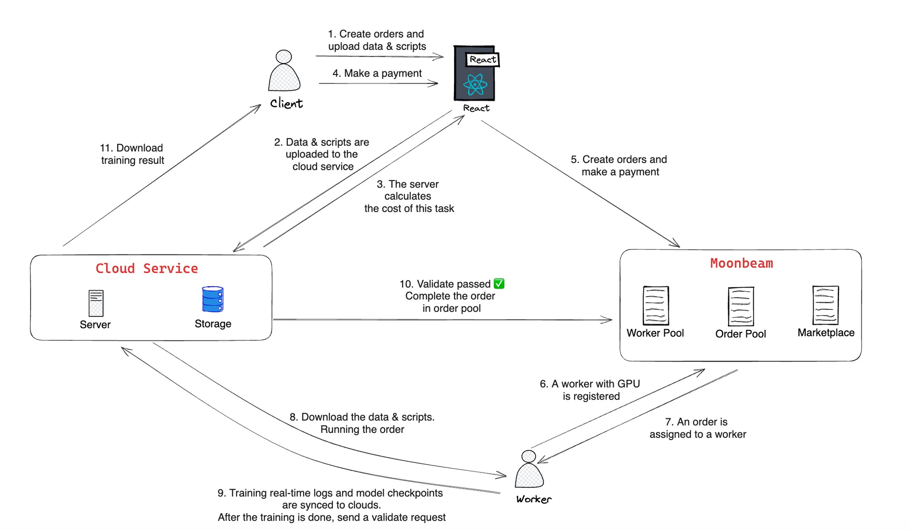
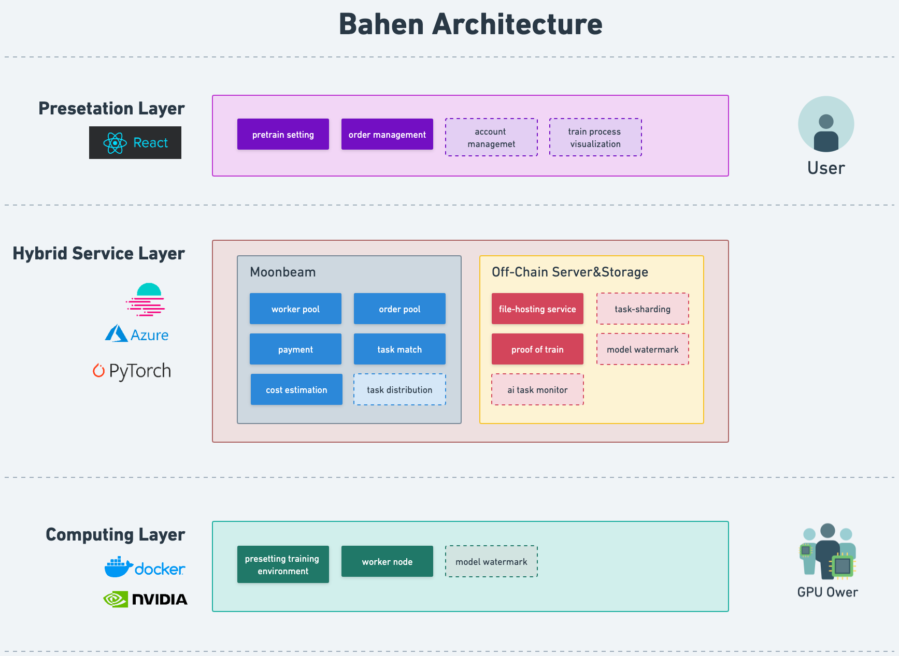
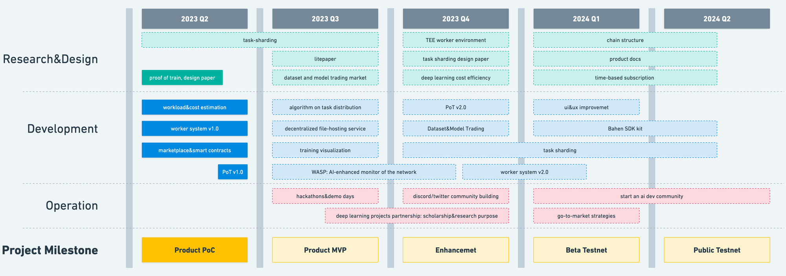

# README

*[English Version](https://www.notion.so/readme_en-bda3f9b85de54f5a94da5dc15e0ee5e5?pvs=21)*

## Basic Information

---

| 项目名称 | Bahen Network |
| --- | --- |
| 简介 | Bahen是一个去中心化分布式机器学习解决方案，旨在为AI应用开发者提供全新的模型训练、人工智能应用部署解决方案并提供公开的数据交易市场。具有空闲GPU计算能力的计算机系统可以接入Bahen Network，通过利用全球大量闲置 GPU供应，帮助缓解计算资源供需缺口的同时，提供更低的价格及更对口的服务。 |
| 官网 | TBA |
| 阶段 | PoC&MVP |
| 项目立项日期 | 2023.03 |

&nbsp;
## Primer on Decentralized Machine Learning

---

人工智能的进步主要由三个因素驱动：

- 算法创新：研究人员不断开发新的算法和技术，让人工智能模型能够更高效、更准确地处理和分析数据。
- 数据：人工智能模型依赖大型数据集用作为训练，使它们能够从数据中的模式和关系中学习。
- 计算：训练人工智能模型所需的复杂计算需要大量的计算能力。

**计算瓶颈**

随着越来越多的企业和消费者拥抱人工智能，计算能力成为了一个关键瓶颈。每隔几个月，AI系统所需的计算量就会翻倍，而供应计算资源的速度跟不上这个增长。此外，训练大规模的人工智能模型的成本也在不断上涨，过去十年中增加了约3100%。

人工智能公司通常面临两种选择：投资自己的硬件并牺牲可扩展性，或者选择云提供商并支付高昂的价格。随着资金成本的上升，初创企业被迫削减云支出。开发和训练人工智能系统需要越来越多的成本和资源，这导致了中心化，只有那些拥有大量预算的实体才能够进行模型的研究和开发。目前，迫切需要一个负担得起的、按需的、无服务器计算平台来进行机器学习工作，而这在传统计算领域是不存在的。

****协作****

越来越多的人工智能开发工作是在大型科技公司内部进行的，而不是在学术界内部进行。比如说，OpenAI, Google, Meta等公司相互竞争并对其模型保持不公开的态度。

缺乏协作导致效率严重低下。例如，如果一个独立研究团队想要开发OpenAI的GPT-4的更强大版本，他们需要从头开始重新训练模型，本质上是重新学习GPT-4训练的所有内容。鉴于仅 GPT-3 的培训成本就达到 1200 万美元，这使规模较小的 ML 研究实验室处于不利地位，并将人工智能发展的未来进一步推向大型科技公司的控制。

如果有一个开放的网络来激励协作，无论是共享模型亦或是数据，结果会怎样呢？

&nbsp;
## Solutions

---
### An Overview of the Proposed Design



### Bahen xDDL Protocol

Bahen xDDL Protocol(Bahen Hybrid Distrubuted Deep Learning Protocol)是一个无需信任的用于深度学习计算、证明的协议。协议将允许拥有闲置算力的GPU丝滑地接入网络完成人工智能深度学习的计算任务。链上的智能合约将确保任务的匹配、订单的支付，以及一个AI-enhanced Hybrid Layer进行任务执行过程中的验证及数据隐私保护。在未来，AI-enhanced Hybrid Layer将进化成一个单独可提供验证服务、分布式学习的服务的中间件层，并允许开发者在编写代码的过程中直接运用SDK调用相关服务。

Bahen xDDL Protocol构建了以下关键的概念及功能（以下为功能介绍，详细的技术文档可在Tech Specs阅读）：

- **Proof of Train 训练证明**
    
    由worker在完成深度学习计算任务后生成的训练证明，Proof of Train将证明两件事：
    
    1. worker是否按照用户的训练脚本执行任务，是否保存了规定数量的模型参数
    2. 任务执行过程中是否保存了规定数量的模型参数
    
    此证明的结果将用于改变训练任务的状态，并触发payment合约。worker仅在通过了proof of train的情况下能获得相应的报酬。
    
- **Worker System 算力提供者系统**
    
    这是一个可运行在Windows和Linux的虚拟机环境，允许worker在环境中执行深度学习计算任务。我们提供了一套基础的深度学习环境，包括预装好的PyTorch函数，使得即使没有深度学习经验的worker也能完成人工智能的训练。除此之外，我们还将提供详细的使用说明以及技术支持，以确保worker能够顺利地进行深度学习计算任务。我们非常注重用户体验，因此我们不断地更新和改进我们的环境，以满足用户的不断需求。
    
- **Task-Sharding 任务分片**
    
    结合Distributed Data Parallelism和Pipeline Parallelism方案，我们将实现在网络中Workers进行组队后完成任务。即可以使一个计算量较大的训练任务拆分到多个节点上进行计算，并同步各个节点的计算进度，最终完成训练任务。同时，Task-Sharding将确保没有一个不受控的节点上存有完整的用户数据，一定程度上保护了用户的数据安全和隐私。
    

### Participants

在我们的网络中有4个角色：

1. **Client(Client)**
    
    Client就是有需求的用户，他们将相关的深度学习数据及模型进行提交、支付并使计算任务可在协议的保护下进行。
    
2. **Worker(GPU Owners)**
    
    Worker将实际执行深度学习计算任务，他们将把拥有GPU的计算机接入Worker Pool，执行模型训练并生成PoT(Proof of Train)提交给Wasp。
    
    在接入Worker Pool时，worker需要提交一定与之计算能力成一定比例的押金，以确保其在执行模型训练的任务过程中没有进行作恶。
    
3. **Validator(GPU Owners)**
    
    Validator将对Worker产生模型进行验证，并生成相应的Performance Report。最终提交给Wasp进行处理。
    
    在接入Worker Pool时，Validator需要提交一定与之计算能力成一定比例的押金，以确保其在执行验证任务的过程中没有作恶。
    
4. **Wasp（AI-Enhanced）**
    
    Wasp负责检查Worker提交的PoT与Validator提交的Performance Report，并将task结果记录至链上。
    
    设计Wasp的初衷在于去学习每个合格的深度学习的过程及结果验证，而渐渐地完善我们的协议保护机制。
    
&nbsp;
## Feature Designs

---

### Flowchart



### Architecture



### Implementation of *Proof of Train*

在黑客松阶段，我们已经实现的的Proof of Train包括两个部分:

1. 通过实时监控训练的数据，（包括training loss, GPU metrics等），来证明worker是否根据client的规定进行训练。
2. 通过对每个保存的模型参数，随机选取一定数量的训练数据，并计算出样本数据的training loss，从而与step 1.进行比较，来验证训练的有效性。

阅读更多：[Proof of Training](./docs/proof_of_training.pdf)

### Draft Design of ***Privacy and Safety Modules***

在我们的项目中，我们采用了一种策略，即客户将培训任务外包给具有GPU的工人。虽然这种方法利用了计算能力并加速了数据处理，但它也引入了一个新的挑战 - 训练数据和脚本隐私的保护。本文详细介绍了我们的隐私和安全模块的设计，提供全面的措施来应对这些挑战。

阅读更多：[Privacy and Safety](./docs/safety_and_privacy.pdf)

### Reseach on *Task Sharding*

在我们的项目中，我们尝试迭代order-task-worker三者的关系。我们试图将一个order拆分成多个任务由在不同地理位置的多个worker完成深度学习计算并同步，从一对一关系变为一对多关系。目前我们处于调研阶段。

阅读更多：[Task Sharding](./docs/task_sharding.pdf)

&nbsp;
## TODOs for Hackathon

---

**Marketplace Front-end Dev**

- [✅]  design webpage version 1.0
- [✅]  development of webpages
    - [✅]  creating order
    - [✅]  order details
    - [✅]  order list
    - [✅]  worker list
- [✅]  intergration with Azure
- [✅]  intergrration with rainbow wallet kit

**Worker System**

- [✅]  worker registration
- [✅]  pytorch fundation package
- [✅]  worker status modification

**On-Chain Service**

- [✅]  order contract
    - [✅]  order generation
    - [✅]  order status update
- [✅]  task contract
    - [✅]  task generation
    - [✅]  task status update
- [✅]  payment contract
    - [✅]  payment vault
    - [✅]  payment release
- [✅]  intergration with moonbeam

**Off-Chain Service**

- [✅]  cost estimation
- [✅]  intergration with azure
- [✅]  proof of train version 1.0
- [✅]  azure file host service

&nbsp;
## How to Run

---

```bash
## Once the smart contracts are deployed to moonbeam and the cloud service is deoloyed:

## 1. Start the front-end for clients and create the order.
cd ./client/src
npm install
npm start

## 2. Register the worker and receives an order & starts training
cd worker
python worker.py
```
&nbsp;
## Future Development

---

### Long-Term Vision

Bahen xDDL Protocol 以及 Bahen Network希望通过打破计算瓶颈和数据协作来促进人工智能领域的多样化发展，使每个人可以平等地探索人工智能的未来。

我们认为AGI(Artificial General Intelligence)并不是一个巨头、一个寡头，如果存在AGI那一定是许多个不同领域的人工智能进行链接而成的。而区块链的去中心化特性将是完成这些链接的基石。

### Road Map



&nbsp;
## Team

---

| Name | Role | Brief  | Contact |
| --- | --- | --- | --- |
| Xiaohu | Product Owner | WEB3 Research Analyst, 多年产品经理经验，本科多伦多大学数学、统计学。目前在团队负责产品开发进度管理以及产品功能设计。 | wechat: xiaohusocool|
| Kejie | Chief AI Scientist | 微软软件工程师，研究生伊利诺伊大学香槟分校MSCS（全奖 research based master program)，本科多伦多大学工程科学系。目前在团队负责AI算法开发、分布式深度学习协议研究及开发。 | |
| Xu | Core DEV | 微软软件工程师，本科北京林业大学，ACM亚洲区域赛银牌。目前在团队负责智能合约开发，后端系统开发，数据隐私研究及开发。 |  |
| Xianchao | Core DEV | 微软软件工程师，毕业于山东理工大学，ACM亚洲区域赛铜牌。目前在团队负责智能合约开发，链上链下通信开发。 |  |
| Jessie | Business & Partnership Manager | 传统行业二级市场研究员，研究生伦敦政治经济学院，本科多伦多大学金融与经济专业。目前在团队负责项目管理、市场研究及合作对接。 |  |
| Harrison | AI Advisor | CS Phd at University of Michigan, Ann Arbor. |  |
| *Bruce | Front-End Engineer | 黑客松组队成员，拥有极其丰富的web3经验 |  |
| *Hao | UI&UX Designer | 黑客松组队成员，拥有7年+的设计经验 |  |

&nbsp;
## Logo
