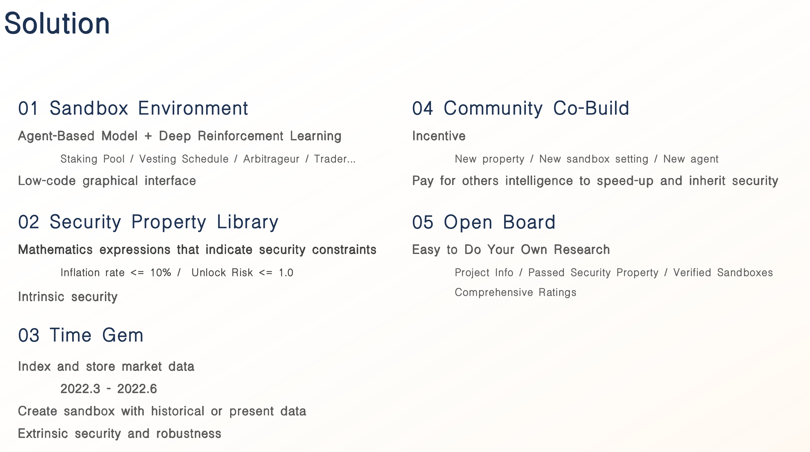
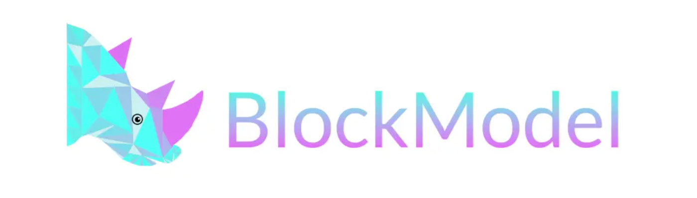

# 基本资料

项目名称：BlockModel

项目立项日期 (哪年哪月)：2022-06

## 报名赛道
赛道三：区块链产品和工具   
赛道四：开放命题   

## 项目整体简介
项目简介，英文提交。包括但不限于：

- 项目背景/原由/要解决的问题 (如有其他附件，可放到 `docs` 目录内。英文提交)。
> Tokenomics security is always a core problem of Web3 ecosystem. However, there is no standards and tools to help Web3er to design & audit tokenomics in a fast and easy way.
- 项目介绍
> BlockModel is building the open protocol for Tokenomics design & audit, providing everyone with ability of participating into projects' Tokenomics, from the begining to the live monitoring. Currently, we also provide Tokenomics consulting service to onboard users.
- 项目Demo
> http://block-model.com  
A quick guide demo video https://youtu.be/st8im-Fox6c  
A case study demo video https://youtu.be/q7lVXuJZ1pE  
- 项目 pitch deck
> https://docsend.com/view/fki3zsie85ijcx4v  

- 技术架构

- 项目 logo (如有)，这 logo 会印制在文宣，会场海报或贴子上。  

- 项目的启始的commit  
https://github.com/ModelLabs/BlockModel-frontend/tree/dev   
We have developed a feature of data visualization panel and security property display.  
We have deployed our product on AWS.  

## 黑客松期间所完成的事项 (2023年7月4日上午11:59初审前提交)

- Update a new version of pitch deck
- Deployed beta product on AWS   
- Released a [Tokenomics Security Audit Report](src/BlockModel-TokenomicsAuditReport.pdf)
- Summon Tokenomics Committee

## 队员信息
Jason, founder @ BlockModel  
Full-stack Developer  
Tokenomics Researcher  
https://github.com/jasonplato  
WeChat: 17710889114    