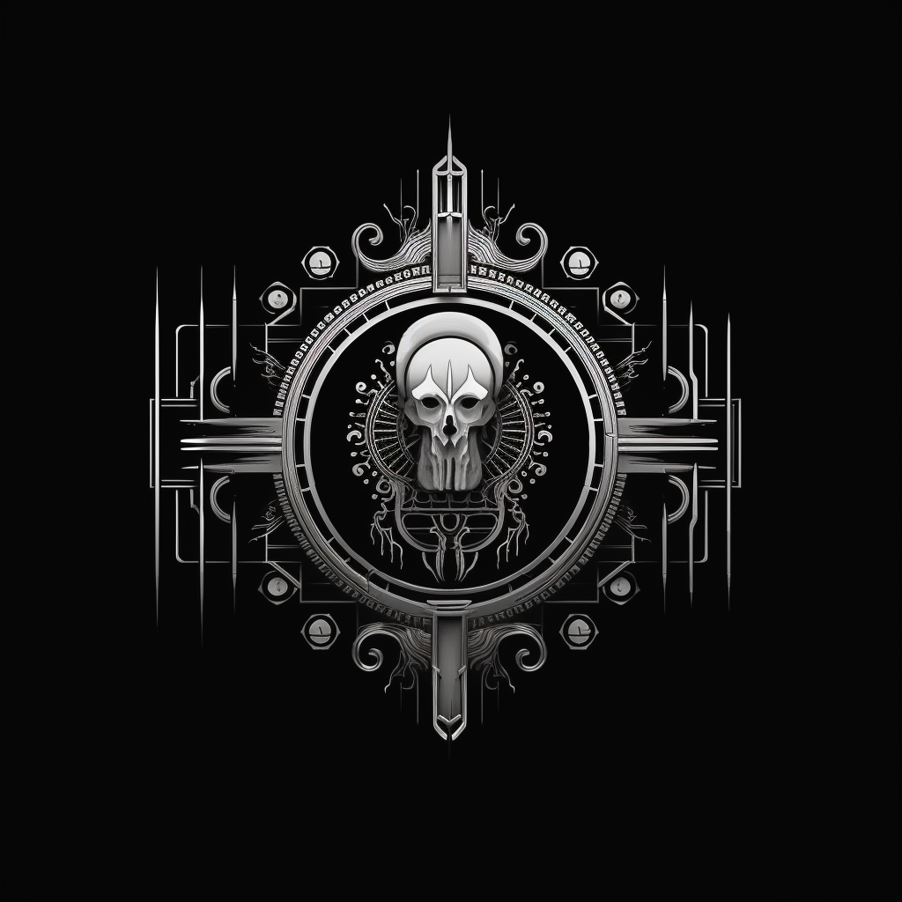

## basic information

Project name: Origin of Civilization

Project approval date: 2023-06-06
<!-- Project Background/Origin/Problems to be Solved/Project Introduction/Project Demonstration/Technical Architecture/Project Logo/Project Initial Review Version/Team Information/Track Track -->
## LOGO

****

## What problem is solved
**Traditional Games**
- Items cannot be freely traded
- Rely on centralized services
- Data opaque and unverifiable

**Current blockchain game**
- Poor game quality and low playability
- high barriers to entry
- not good enough

****
## Project Description

Origins of Civilization is an epic game that combines management simulation, real-time strategy, and action-adventure. In the game, you will play the role of a civilization founder, starting from the most basic tribe, and gradually building a powerful civilization empire. You need to manage resources, develop technology, build cities, and fight or cooperate with other civilization players. The adventure elements in the game are also very exciting, you can explore mysterious maps, discover treasures, and challenge tasks of various difficulties. The Origin of Civilization will take you into a world full of challenges and fun, come join us and start your civilization journey!

****
## Game route planning:

1. Resource gathering and infrastructure building: At the beginning of the game, players need to gather resources, build infrastructure, and ensure that the basic needs of the people are met, such as food, shelter, and safety. These resources can be obtained through means such as gathering, farming and mining.

2. Technology research: Players need to invest resources in technology research to improve the technology level of the city, so as to obtain more resources and higher efficiency. These technologies can cover agriculture, mining, construction, defense, and more.

3. Social Development: As the city continues to grow, players need to manage the city's residents to ensure their needs are met, while also taking into account the city's cultural and educational development. During this phase, the player needs to deal with political and economic issues such as collecting taxes, advising and managing resources within the city.

4. Diplomatic Relations: Players can obtain more resources and technologies by establishing diplomatic relations with other cities. Players need to consider how to manage relations with other cities, establish trade and alliances, and also need to keep the city's defense and safety.

5. World Exploration: Players can explore the world and discover new resources and territories. During the exploration, players need to pay attention to the dangers and challenges encountered, such as wild animals, natural disasters and other threats to civilization.

6. Rise of civilization: In the final stage of the game, players need to manage the development of the entire civilization and ensure the continued development of cities and countries. Players need to consider how to maintain the peace and prosperity of civilization, but also need to deal with various challenges and threats.

****

## Project Development Plan

- The first stage:
 Introduce the most basic gameplay, deploy to MoonBeam, Ethereum and other chains, players can interact with smart contracts through Dapp

- second stage:
 Deployed to the Polkadot ecological chain. Including solidity development version and Ink development version, covering users of multiple chains

- The third phase:
 Launch PC and Android, IOS applications, lower the threshold for players to participate in the game, and guide more non-Web3 new users to enter the game
- Fourth stage:
 At this stage, the various gameplays of the game have basically been developed. Players on each chain can play against each other, and will expand their influence by holding events.

****
## Things planned to be done during the hackathon

**Blockchain side**
- **Smart Contract**

 - [x] User Registration-Smart Contract
 - [x] Players create forces and store data on the chain
 - [x] Beginner Gift Pack - Smart Contract
 - [x] Gameplay - part of the smart contract

**client**
- **web terminal**
 - [x] Project home page development: [Home](https://civi.ink/)
 - [x] User registration page, create forces: [Dapp](https://app.civi.ink)
 - [x] NFT novice gift pack collection: [Dapp](https://app.civi.ink)
 - [x] NFT product purchase process: [Dapp](https://app.civi.ink)

****
## Items completed during the hackathon (submitted before the first review at 11:59 am on July 4, 2023)
 - [x] Project home page development: [Home](https://civi.ink/)
 - [x] Dapp Development: [Dapp](https://app.civi.ink/)
 - [x] User Registration-Smart Contract/UI
 - [x] Player created character function - smart contract/UI
 - [x] Players create forces, players join other forces - smart contract/UI
 - [x] The function of players playing against each other - smart contract/UI
 - [x] Consume NFT, enhance the function of character attributes-smart contract/UI
 - [x] Player Combat Power Calculation-Smart Contract/UI

****
## Project Demo

[demo video](https://www.youtube.com/@OriginofCivilization/featured)
****

## Technology Architecture
**data storage**
- Some data, such as (user registration, role creation) and other information are stored in separate contracts, so that these data can be used without loss when other contracts are upgraded later
- Each function uses a separate contract, and the contracts call each other to facilitate later upgrades and only modify part of the contract
****

**Competitive gameplay**
- Develop trusted services to allow user data to be mapped to games
- Deploy a game network all over the world, so that players can play games online with low latency, making the game experience better

****

## Player Information

| Name | Role | GitHub Account | WeChat Account |
| -------------| ------------| ----------- | ----------- |
| Wang Zhou | Founder & dev | differs | chatid8146701ae86 |

****
## Belonging track
|Open Proposition|Smart Contract|
|-------|-------|

