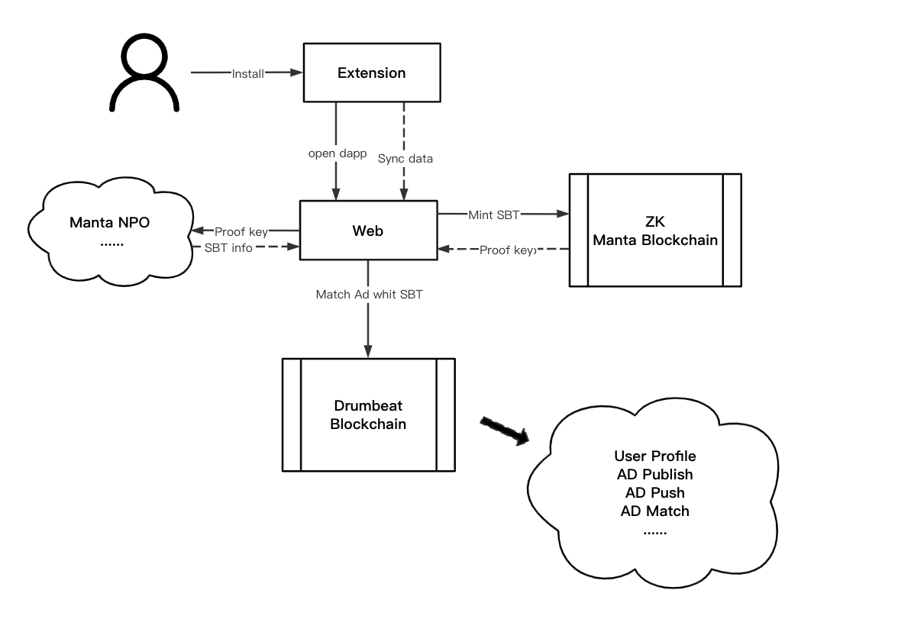
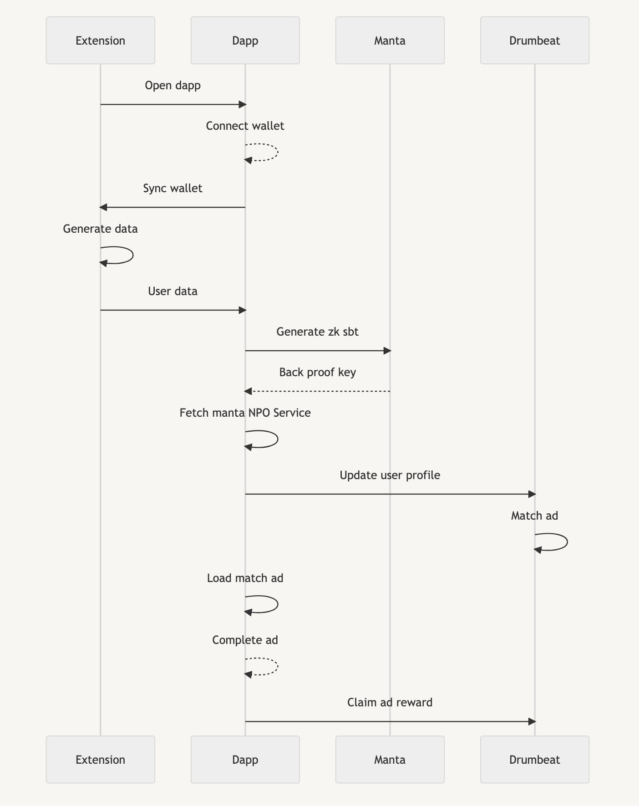

# Drumbeat

### Background
DrumBeat is a Web3 advertising protocol used Manta Network's modular ZK systems which enable on-chain privacy for any web3 ecosystem as well as the decentralized applications that live on them., completely designed and customized for Web3.
Based on users' on-chain and off-chain behaviors, DrumBeat helps Web3 projects acquire users and promote their products in a decentralized way.
Unlike Web2 advertising platforms, in DrumBeat users own, control and profit from their own data. The data used for ad matching is fully authorized by the user and is processed in a privacy-protected manner.
DrumBeat also enables Web3 content creators, and Metaverse landholders to monetize their content and land in a simple and decentralized way.

### Demand
Web3 startups often struggle to promote their products and services at an early stage due to limited marketing options. Traditional strategies, such as building communities on Telegram and Discord, can be resource-intensive, inflexible, and provide poor metrics analysis. We use Manta's solution to generate zkSBT through user behavior, and provide a new advertising solution on the basis of protecting user privacy.

### Workflow

### License
GPLv3
