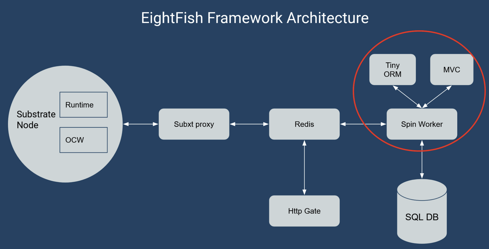
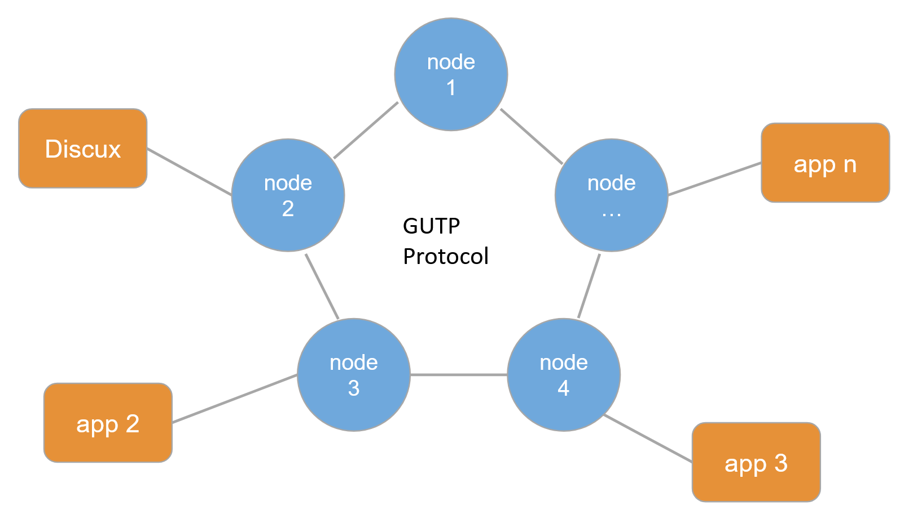

## Basics

Team Name: Nomocracy

Project Name：GUTP Discux

Project Starts From：2023.05.15

## Project Intro

### Background

Web3 has developed for years, and has achieved huge success in the field of crypto token (e.t. btc, stable coins, DeFi). People began to exploit the challenging realm of Internet, intending to copy the success from asset area, but they met obstacles. Years past, the Web3 app is yet hard to use, with high threshold and low response rate. There are some underlying limitations to explain why couln't the mainstream Web3 tech stack solve the requirements of Internet application (see: (my talk on RustChinaConf 2023)[https://www.bilibili.com/video/BV14X4y1p7De/?spm_id_from=333.999.0.0]) .

### A New Proposal - EightFish

We did much research on how to bring blockchain technologies to traditional Internet, and built the theory of [Open Data Application](https://medium.com/@daogangtang/the-road-to-open-web-b684879a5571). 

Based upon this theory, we built a new development framework: [EightFish](https://github.com/eightfish-org/eightfish). 

EightFish is a development framework (maybe the first one) for the Open Data Application (ODA), implementing the Open Data Application Model (ODAM). The theory of the ODA and ODAM is located [here]((https://medium.com/@daogangtang/the-road-to-open-web-b684879a5571)). In short description: EightFish powers ODAs, ODAs constitute the Open Web.

Concretely, EightFish is a framework to develop a decentralized application in Web2 development style.

Unlike the smart contract blockchain tech stack most DApps adopt, EightFish makes your own network, a sovereign network which doesn't rely on any other Web3 layers or services.

By some elaberate designs, EightFish reaches the experiences of Web2/Internet web development, but for the OpenWeb/Web3 decentralized application.

Internally, EightFish consists of **Substrate**, [Spin](https://developer.fermyon.com/spin/index), redis, postgres and other components.

NOTE: EightFish itself is not a service/platform/serverless, it is just a dev framework tool.

Some progresses of EightFish:

1. We have done the first grant from W3F. See [milestone II](https://github.com/w3f/Grant-Milestone-Delivery/pull/842)
2. We have done the last round of interview of Substrate Builder Program

**EightFish is the THIRD way to develop decentralized app in the Substrate/Polkadot ecosystem**.

Other stuff:

- Deck 1: [Use EightFish to Develop the Decentralized Open Data Application ](https://docs.google.com/presentation/d/1TxrAWXW40hNo9-VYAaLt7JDMIj028TH97SvATtwOIv0/edit?usp=sharing)
- Deck 2: [EightFish for Substrater](https://docs.google.com/presentation/d/1YIz5rv2R-P8gF-4vvAyHYb0rCGUrUUM0HEpB8ywIcfo/edit?usp=sharing)

### GUTP + Discux

But EightFish is just a development framework, it needs something to verify itself. So we start a new project in this hackathon to test it. This new project is called GUTP - General User Text Persistence protocol.

GUTP is a decentralized protocol running on the Substrate network, built in EightFish framework.

And GUTP is merely a protocol network providing data service for other application. So consequently we build another project named Discux to connect to GUTP to provide Web service for end users.

Discux is a forum application with nearly the same UI/UX against to traditional Internet forum product such as Discuz/Discourse. Users can share their ideas and comments on this forum. It's a general decentralized forum based on Substrate and EightFish stack.

Discux has its own backend and frontend implementations.

### The Architecture of Them

EightFish architecture.

The architecture of GUTP and Discux.

### Commits

EightFish was started at the beginning of 2023, so we won't put it into the achievement of this hackathon. 

The GUTP and Discux were newly created projects for this hackathon.

## Planed Targets

**GUTP**

- GUTP data service protocol
  - [X] GUTP model definitions (SQL schema and Rust types)
  - [X] user data service
  - [X] subspace data service
  - [X] post data service
  - [X] comment data service
  - [X] tag data service
  - [X] posttag data service
  - [X] postdiff data service
  - [X] moderator data service

**Discux**

- Backend
  - [X] router with http biz end points
  - [X] app_state
  - [X] redis connection for session management
  - [X] biz of user
  - [X] biz of subspace
  - [X] biz of article
  - [X] biz of comment
  - [X] biz of tag
  - [ ] login with github

- Web pages
  - [ ] user register
  - [ ] github login flow
  - [ ] forum subspace crud
  - [ ] forum post crud
  - [ ] forum comment crud
  - [ ] forum tag crud

- Flow tests
  - [ ] flow tests between GUTP and Discux

## What have been done during Hackathon

- All stuff of GUTP
- The backend stuff Discux backend, with some compiling errors

## Members of This team

Mike Tang, Researcher and Architect, https://github.com/miketang84, daogangtang  

Hancken, Rust and Substrate Dev, https://github.com/taokeqin, tkeqin
