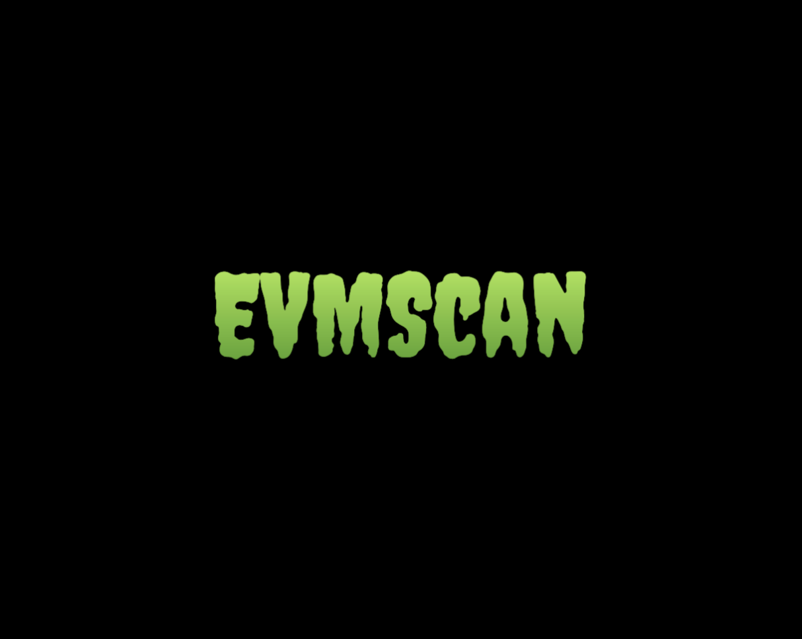

## EVMScan

- project name: `evmscan`

- project created：`2023-06-09`

## EVMScan Logo

## Introduction

EVMScan is an open source MVP version's explorer(inspired by [etherscan](https://etherscan.io/)) for EVM compatible solutions, such as Ethereum/Sepolia, Arbitrum, Optimism, Coinbase Base, ZKSync era and Polygon zkEVM etc.

## Tasks planning during hackathon-2023-summer

### backend
- [ ] `evmscan_indexer`: the application of syncing blockchain infos for explorer
- [ ] `evmscan_schema`: the data schema of explorer and some common useful public function  
  - [x] block schema
  - [x] transaction schema
  - [x] withdrawal schema
  - [ ] smart contract schema
  - [ ] token schema
  - [ ] token transfer schema
- [ ] `evmscan_api`: the graphql api of explorer that use for frontend or third-party service
  - [ ] block
    - [x] protocol
    - [ ] resolver
  - [ ] transaction protocol
    - [x] protocol
    - [ ] resolver
  - [ ] withdrawal protocol
    - [x] protocol
    - [ ] resolver
  - [ ] smart contract
  - [ ] token
  - [ ] token transfer

- [ ] `evmscan_rpc`: the SDK of EVM-compatibility solution's rpc service
  - [x] block rpc
  - [x] transaction rpc
  - [ ] smart contract rpc
  - [ ] token rpc
  - [ ] token transfer rpc
- [ ] `api docs`: the docs of graphql public service
  - [x] block docs
  - [x] transaction docs
  - [ ] smart contract docs
  - [ ] token docs
  - [ ] token transfer docs
- [ ] `testing`: testing for api service
  - [ ] block api testing
  - [ ] transaction api testing
  - [ ] smart contract api testing
  - [ ] token api testing
  - [ ] token transfer api testing
- [ ] `devops`: devops use for api service
  - [ ] CI
  - [ ] CD

### web frontend
- [ ] `Scaffold`: frontend scaffold
- [ ] `Home page`: show latest 10 blocks info, latest 10 transactions info and more stats info
- [ ] `Searching Bar`: search with address, blocknumber, transaction hash and token name etc
- [ ] `Block Page`: show block infos
- [ ] `Transaction Page`: show transaction infos

## Future Plan
- [ ] `Multi EVM-Compatible Solutions Select`: multi evm-compatible-chain data integrate
- [ ] `SmartContract Page`: show smart contract infos
- [ ] `TokenTransfer Page`: show token transfer infos
- [ ] `Token Page`: show token infos, such as erc20/erc721/erc1155

## Team Information
- Team name: [OpenBEAMer](https://github.com/OpenBEAMer)
- Github: [https://github.com/OpenBEAMer](https://github.com/OpenBEAMer)

## Members
- [Naupio Z.Y. Huang](https://github.com/naupio) - Technical Lead - WeChat: NaupioH
- [Jim Z.J. Huang](https://github.com/JimHanss) - Front-end Developer - WeChat: wxid_p5372vdwvcnu22