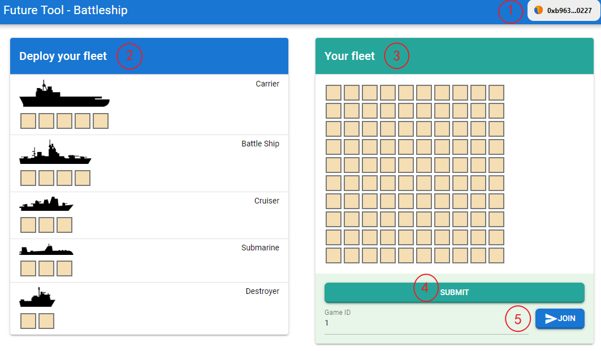
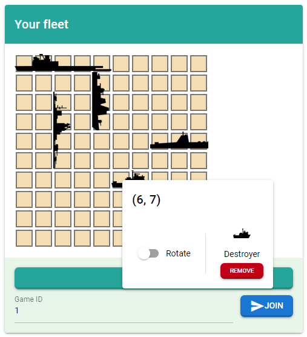
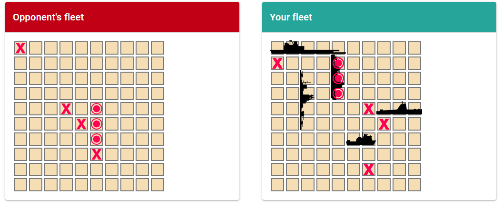
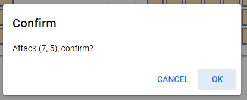

## 初始化

1. 首先是连接钱包
2. 目前游戏允许的舰队船只类型是这五种
3. 在10x10的方格中部署自己的舰队
4. 部署完成后点击提交，开启一轮新的游戏
5. 或者选择用现有的方案加入其他人已经创建好的游戏

（以下是一种部署好的方案图）

## 游戏过程

- 左侧是对手情况，点击任意位置发起攻击
    
- 右侧是对手攻击己方的情况
- 圆圈表示攻击成功，而X表示攻击失败
- 发起攻击后，要等一会儿待区块链确认后，才可以看到攻击情况