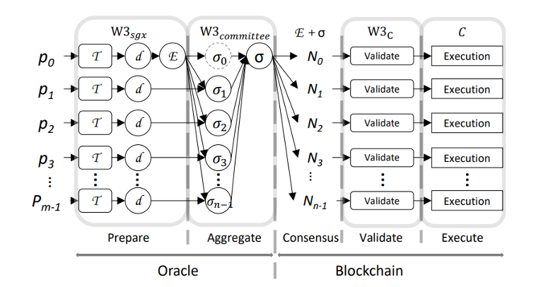
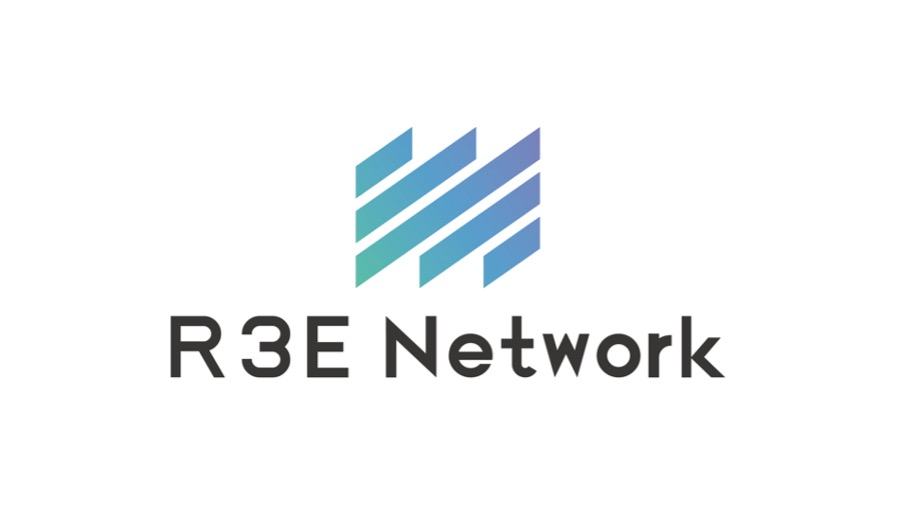

## 基本资料

项目名称：R3E-Network

项目立项日期：2023.04

## 项目整体简介

- 项目背景
Currently, there are mainly two types of oracles:
Data Feed oracle. Data providers synchronize data to the chain according to certain rules. For example, the rule of ChainLink for updating bitcoin prices on Ethereum is to update the data every 0.5% of the bitcoin price outside the chain.
Data API oracle. Feedback a large amount of different types of data to smart contracts through callbacks. The advantage of this type of oracle is that it can fetch virtually unlimited data types. However, the disadvantage is that each data request from a user requires two transactions to obtain the required data, so the time delay introduced by the consensus is very considerable.
These two kinds of oracle machines initially meet the data availability requirements of smart contracts, but due to the fundamental problems in their respective structures, the data they provide still have problems that cannot be ignored in terms of accuracy, timeliness, and cost of use. If we want to get very accurate data, not a price with a rate of change of 0.5% like Data Feed; or we need the real-time price that the user sees when sending the transaction, not when the user transaction is packaged on the blockchain The price of the oracle machine, even the price when the oracle machine pulls back, the existing oracle machine mechanism cannot meet these needs. In other words, we cannot obtain accurate real-time data through existing oracles. In addition, the LUNA crash that shook the entire cryptocurrency and blockchain field also exposed the problem of oracles. After analysis, when the price of LUNA fluctuates most violently, the price change can reach about 40% per minute. This level of price change cannot be accurately captured by the existing oracle mechanism. Obviously, the existing oracle system is inefficient when submitting data for the blockchain, the quality of the submitted data is not accurate, and it cannot cope with the black swan event in the blockchain world.
Therefore, it is necessary to continue to improve the performance of the oracle machine in terms of data real-time and accuracy, so as to adapt to the more and more extensive application scenarios of the oracle machine.

- 项目介绍
In order to solve the problems of existing oracle machines, we hope to build a fully distributed oracle machine with low cost, strong scalability, low latency and high data accuracy. Therefore, we propose R3E, a TEE-based real-time oracle.
R3E can process user data requests off-chain. Users construct meta-transactions (EIP712) locally and then send meta-transactions to our servers. The server requests corresponding data by parsing the user's meta-transaction, and then packages the acquired data together with the user's meta-transaction into an oracle transaction and broadcasts it to the blockchain. The oracle contract we deploy on the blockchain parses the oracle transaction, extracting the user's meta-transaction and the data of the oracle node. Then call the user contract according to the meta transaction, and pass the data to the user contract for execution.
R3E utilizes TEE technology to ensure data security and privacy. TEE is a Secure Execution Environment that protects data and code from malicious access from the outside. In R3E, the user's data request is processed securely, and the result is reliably transmitted back to the smart contract, while ensuring data integrity and immutability. This makes R3E a highly reliable and flexible oracle solution for various application scenarios.
Additionally, R3E's decentralized and scalable nature means it can easily adapt to changing needs. With the development of blockchain technology and the continuous expansion of applications, the demand for data will become more and more diverse and complex. R3E's design allows new data sources and functionality to be easily added to meet future needs without compromising performance.
Compared with the traditional oracle system, the R3E oracle machine will provide higher data accuracy (the error can be controlled below 0.1%), lower latency (the data delay is at the millisecond level, and the transaction confirmation delay is within one consensus cycle), Less on-chain data (only one transaction is needed to obtain off-chain data) and lower maintenance costs (no need to synchronize data to the chain in real time, saving tens of millions of dollars in on-chain data maintenance costs).
In summary, R3E provides an oracle solution for smart contracts with high security, real-time performance, accuracy and scalability. By bringing the data and usage experience of Web2.0 into Web3.0, R3E will help promote the wide application and popularization of blockchain technology in various fields. At the same time, R3E also provides a unique and challenging research area for researchers and developers to continuously improve and perfect oracle technology, contributing to the continuous innovation and development of the blockchain field.

- 项目Demo

- 技术架构
R3E mainly includes three parts: the oracle node runtime (R3E sgx), the oracle committee (R3E committee), and the oracle contract (R3EC). Among them, R3E sgx and R3E committee run outside the chain, while the R3EC contract resides on the blockchain. We denote smart contracts using R3E services by UC. The off-chain owner is the client, the user who initiates the meta transaction to invoke UC. One data source is an online server (running HTTPS), and R3E uses the data provided by these data sources to package users' meta transactions to construct oracle transactions. Figure 1 is a schematic diagram of the structure of R3E, showing the interaction of its internal parts.

Pi is the oracle node belonging to the same committee, T is the meta transaction from the user, d is the data obtained by the oracle node through the data API, E is the oracle transaction constructed by the leader node P0 of the committee, σi is the oracle The nodes Pi sign the BLS signature of transaction E, σ is the BLS aggregate signature aggregated from the BLS signatures of each oracle node, and Ni is the consensus node in the blockchain network.
Oracle Node. An oracle node is a device that supports SGX and runs the R3E program. The node runtime is a program running in the enclave of SGX, which is mainly responsible for generating and managing BLS accounts, processing users' meta transactions, and obtaining data from data sources. For security, each oracle node has only one runtime.
Oracle Committee. The oracle committee is the basic unit for processing user meta-transactions, and each oracle committee consists of at least four oracle nodes runtime. To reduce latency, nodes in the oracle committee have direct network connections and can exchange information without going through intermediate nodes. When processing a user's meta-transaction, the committee designated by the user is called the response committee, and the two committees that start with the response committee number and continue will automatically become alternate committees for the meta-transaction. Both the Response Committee and the Alternate Committee will request data from the data source as soon as the meta transaction is received, but the Alternate Committee will only generate the oracle transaction after the timeout is triggered. For different response committees selected for different meta-transactions, the response committees execute in parallel without interfering with each other.
Oracle Contract. The oracle contract is an entry contract deployed on the blockchain to connect all R3E transactions. It is mainly responsible for verifying the authenticity and integrity of oracle transactions from the committee, parsing oracle transactions, deducting transaction fees from user accounts, and calling user contracts. In addition, the oracle contract also needs to intercept exceptions thrown in the user contract to prevent the transaction from being maliciously rolled back.

- 项目 logo

- 项目的启始的commit，对于全新的项目可以是一个开源框架的clone，比如区块链clone自substrate-node-template, react
框架等，请给出说明。对于成熟项目可以是一个branch，要求在2023年5月12号之后生成，说明有哪些功能是已经有了的

## 黑客松期间计划完成的事项

- 请团队在报名那一周 git clone 这个代码库并创建团队目录，在 readme 里列出黑客松期间内打算完成的代码功能点。并提交 PR 到本代码库。例子如下 (这只是一个 nft 项目的例子，请根据团队项目自身定义具体工作)：

**区块链端**

- `pallet-nft`
  - [ ] NFT 创建及数据结构定义 (`fn create_nft()`)
  - [ ] NFT 转帐函数 (`fn transfer()`)
  - [ ] NFT 销毁函数 (`fn burn_token()`)

**客户端**

- web 端
  - [ ] 用户注册页面
  - [ ] NFT 产品创建流程
  - [ ] NFT 产品购买流程

- hybrid (react-native)
  - [ ] 用户注册页面
  - [ ] NFT 产品创建流程
  - [ ] NFT 产品购买流程

## 黑客松期间所完成的事项 (2023年7月4日上午11:59初审前提交)

- 2023年7月4日上午11:59前，在本栏列出黑客松期间最终完成的功能点。
- 把相关代码放在 `src` 目录里，并在本栏列出在黑客松期间完成的开发工作及代码结构。我们将对这些目录/档案作重点技术评审。
- Demo 视频，ppt等大文件不要提交。可以在readme中存放它们的链接地址

## 队员信息

包含参赛者名称及介绍
在团队中担任的角色
GitHub 帐号
微信账号（如有请留下，方便及时联系）