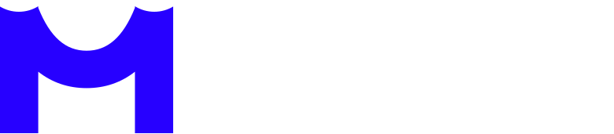
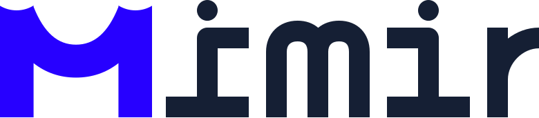

## 基本资料

项目名称：Mimir

项目立项日期 (哪年哪月)：2023-3

## 项目整体简介

### **Existing Problem**

With multisig wallets being increasingly adopted by projects, institutions, and organizations, more funds are being stored in multisig wallets. In the Polkadot ecosystem, approximately 3% of the total $DOT supply is held in multisig wallets. However, once deposited in multisig wallets, the use and management efficiency of these funds is significantly reduced due to the absence of a flexible solution that enables multisig wallets to access and interact with various apps (such as Sub ID, Polkassembly, Staking, OpenGov and etc.).

Given the large amount of funds managed and the high importance of participation, not being able to leverage these funds for constructive purposes is undoubtedly harmful. In the Ethereum ecosystem, Gnosis expanded the application scenarios of multisig wallets by supporting a wide range of apps. However, in the Polkadot ecosystem, no product currently offers multisig and single signature wallet users a similar experience.

Furthermore, while the Polkadot ecosystem offers powerful pallet features, it lacks user-friendly interfaces for these functionalities. This limits the adoption and promotion of these powerful features, hindering the showcasing of Polkadot's strong architectural design and technical implementation capabilities.

### **Context of Proposal**

The abstraction and architectural capabilities of the Polkadot ecosystem are incredibly powerful. It uses a variety of pallets to modularize various operations that occur on a blockchain, making it easier for developers to create new chains. However, for users, compared to Ethereum, where they only need to use applications, the Polkadot ecosystem requires understanding the chain's runtime, which indeed raises the barrier to entry. We are fortunate to see more and more projects focusing on presenting these pallets with more user-friendly interfaces, such as governance-related Polkassembly, multisig-related Polkasafe, and identity-related SubID. This makes the originally obscure and difficult-to-understand features more accessible and easier for the community to adopt and use.

To achieve this goal, we have conducted extensive research on various schemes, and ultimately, Mimir hopes to use wallets as carriers and gradually expand the range of applications in the Mimir App, presenting multiple commonly used Calls (such as Transfer/Batch Transaction/Proxy/Identity, etc.) in a more user-friendly manner. The addresses that interact with these Mimir Apps can be both single-signature addresses and multisig addresses, making Mimir a **one-stop user-friendly asset management tool** preferred by users in the Polkadot ecosystem.

Therefore, our first priority is to make Mimir compatible with the functions related to multisig addresses.

In the Ethereum ecosystem, the Safe contract holds a total of 2,113,767 ETH and some ERC20 tokens. According to Dune's data, the total value of ETH+ERC20 tokens has reached $38,495,294,130, of which ETH accounts for 1.7% of the total ETH supply. In the Polkadot ecosystem, the assets managed by multisig wallets for DOT/KSM account for about 3% of the total DOT/KSM supply. With the continuous development of the Polkadot ecosystem, the asset management scale of multisig wallets in the Polkadot ecosystem will continue to improve in the future.

At present, there is still room for improvement in the user-friendliness of multisig management tools in the Polkadot ecosystem, such as Polkasafe/Polkadot.js/Subscan Multisig Tool. Compared with these management tools, Mimir also has some unique ideas:

1. We hope that users can use both single-signature and multisig wallets in Mimir, and in the future, hardware wallets will also be supported.
2. We will extensively integrate third-party apps and also develop some Mimir Apps to fill the market gap.
3. We will focus more on user-friendliness, making complex parameters simple and easy to understand for users, making the entire process easier to use.

Based on this starting point—productizing a wide variety of pallets in the Polkadot ecosystem—we propose the idea of Mimi. Firstly, we will start with multisig, then expand to more related pallets such as proxy, batch transaction, identity and recovery,ultimately extend to more chains within the Polkadot ecosystem.

### **Proposal Solution**

We will provide an asset management tool with a core focus on "DAPP" integration – Mimir. In this tool, users can enjoy a nearly identical DApp usage experience with both single and multisig wallets within the Polkadot ecosystem.

Additionally, we will develop various small-scale DApps to encapsulate Polkadot's native pallet functionalities as mini DApp products. This will enable users to access these features in a simple, fast, and convenient manner, complementing the capabilities of Polkadot.js with user-friendly interfaces.

### **Mimir Description**

Mimir is an asset management tool focused on user interaction, presenting various Polkadot ecosystem pallets in a productized format. It supports not only single-signature addresses but also multisig addresses. Users can access various existing Polkadot ecosystem applications through Mimir using multisig addresses. Additionally, Mimir will also develop its own DApps, productizing Polkadot pallets for user convenience.

Of course, it also covers some fundamental wallet features, such as multisig creation processes, address profiles, address books, and transaction queues.

We hope that through the development and application of Mimir, more community users can experience the powerful features of the Polkadot ecosystem and present the originally challenging-to-use functions in a more user-friendly manner.

### **LOGO**

  

### **Design**

https://www.figma.com/file/ubMOzTb1LTEdXjw3UhyCCV/Mimir?type=design&node-id=0%3A1&t=52ZY7iatWIv55sYV-1

## 黑客松期间计划完成的事项

**Features**

- web 端
    - [ ]  Plugin wallet login for Mimir
    - [ ]  Create or import a multisig wallet and configure the network for the multisig wallet
    - [ ]  Profile, including asset display and multisig wallet owners display
    - [ ]  Transaction History, including transaction queue and transaction history records
    - [ ]  Address Book, for storing frequently used contacts and multisig members
    - [ ]  Basic transfer function
    - [ ]  Notification feature after initiating a multisig transaction
- 服务端
    - [ ]  Recover Multisigs
    - [ ]  Transaction History Record

## 黑客松期间所完成的事项 (2023年7月4日上午11:59初审前提交)

- 

## 队员信息

| 队员姓名 | 工作 | 微信号 |
| --- | --- | --- |
| Wilson | UI | WLBforsure |
| Frank | PM | Junweif2 |
| Jarvan | Full Stack | zzcadmin |