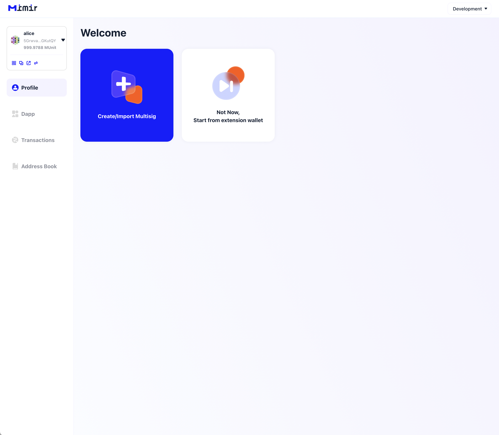
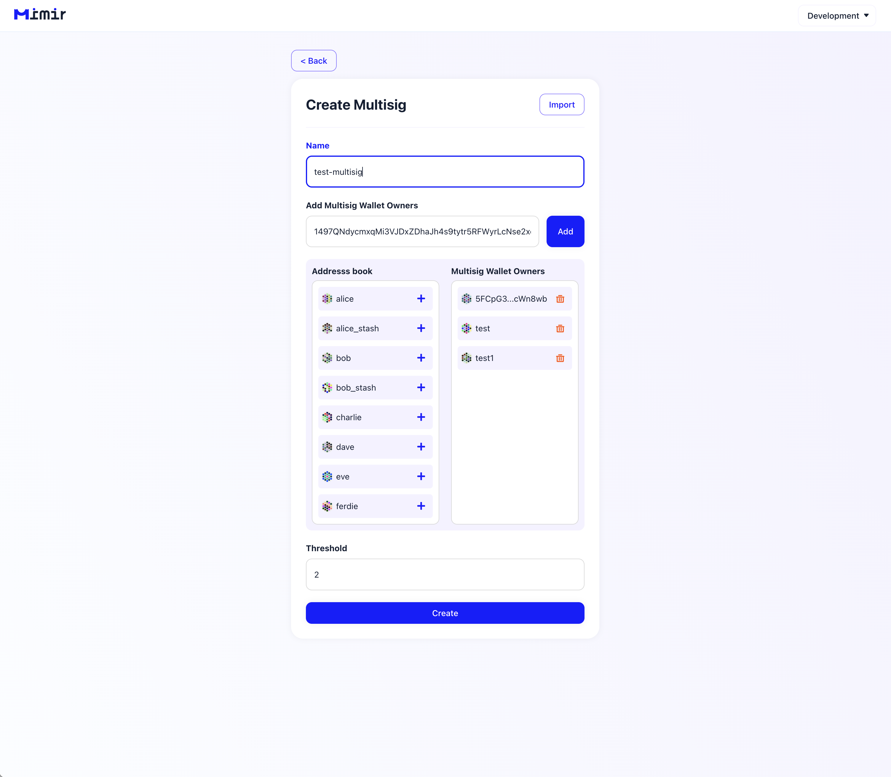
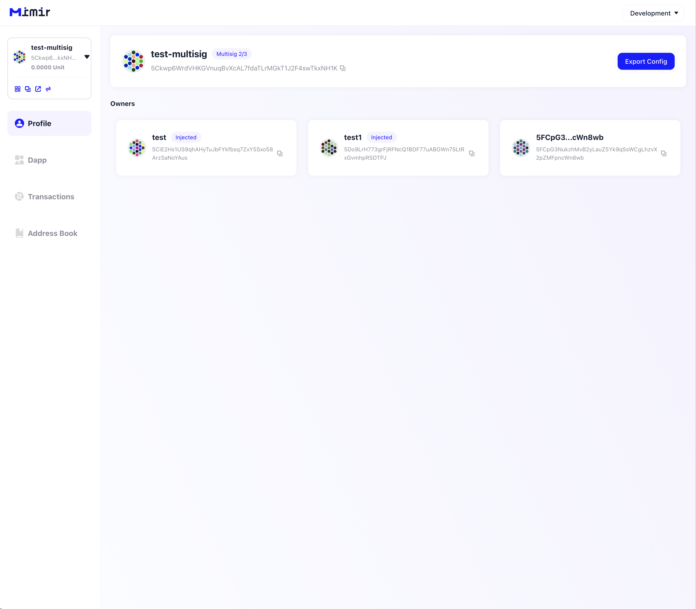
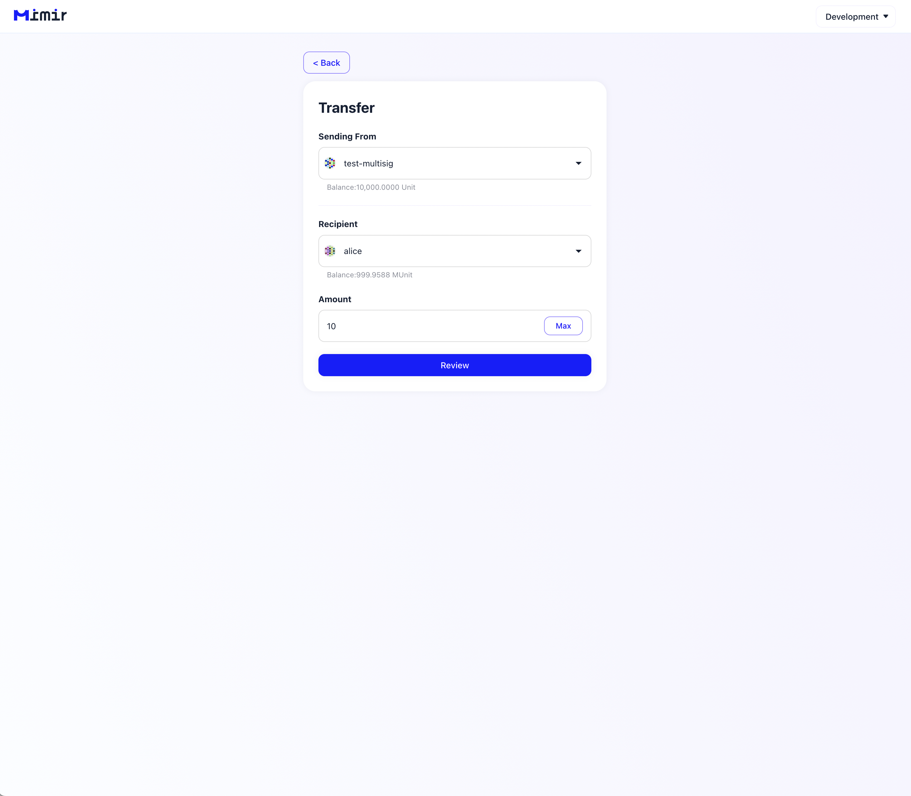
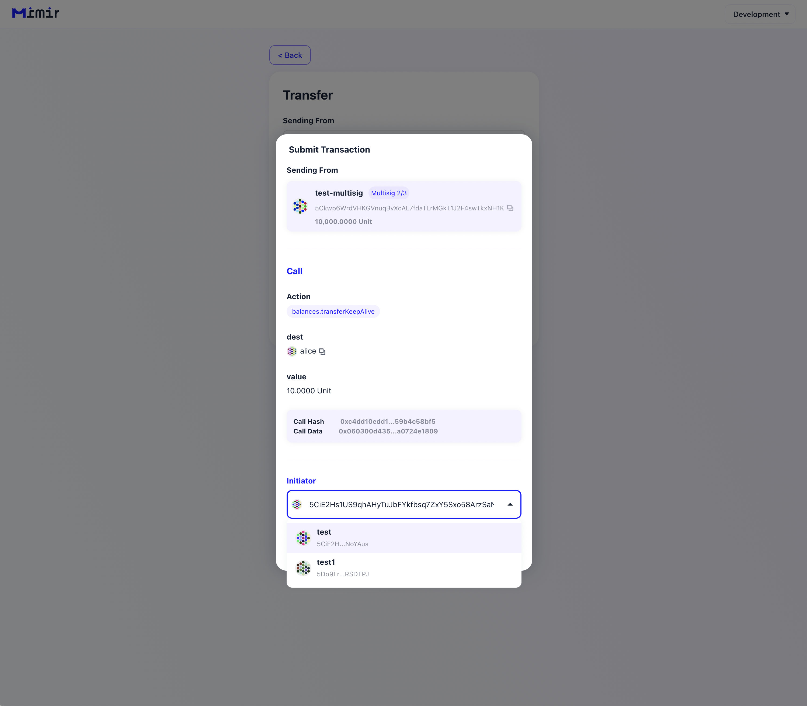
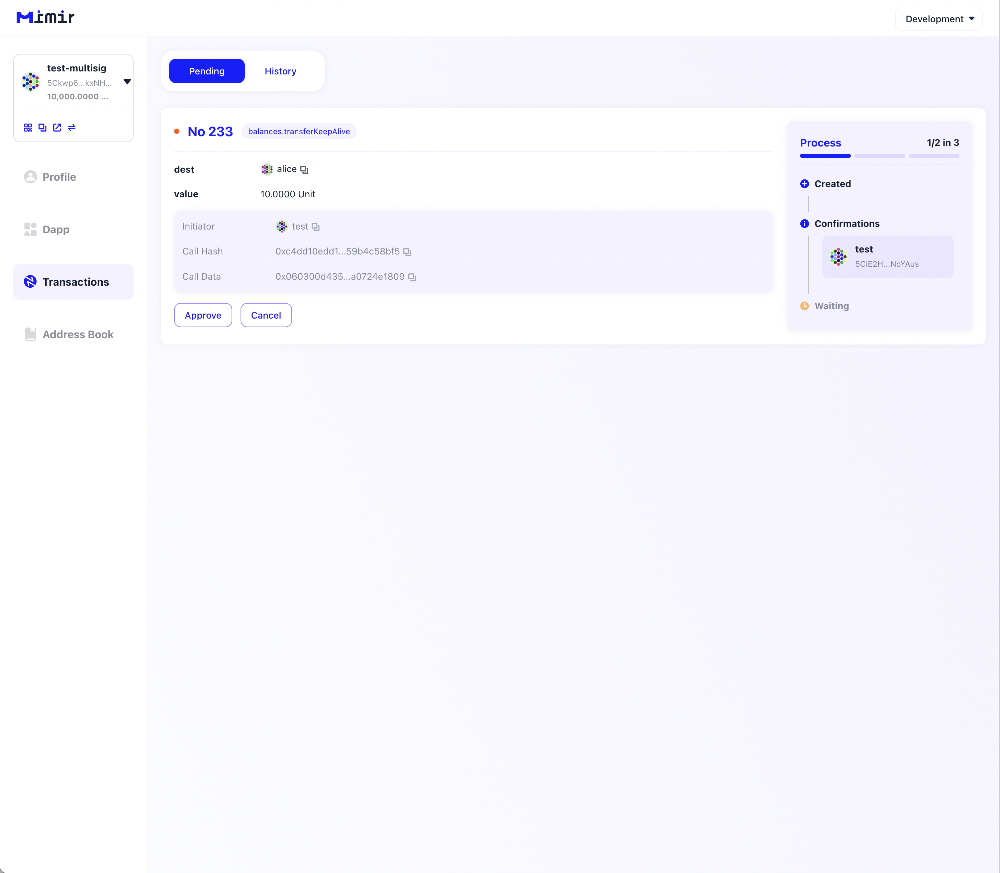
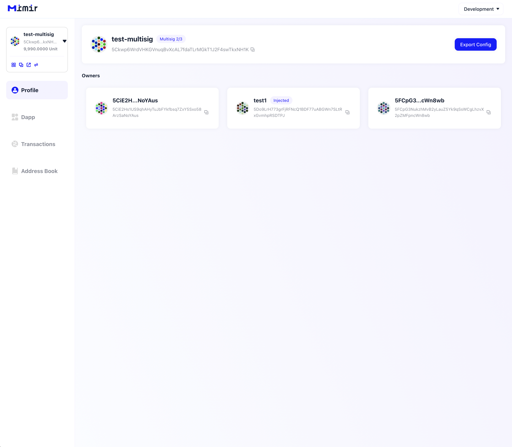
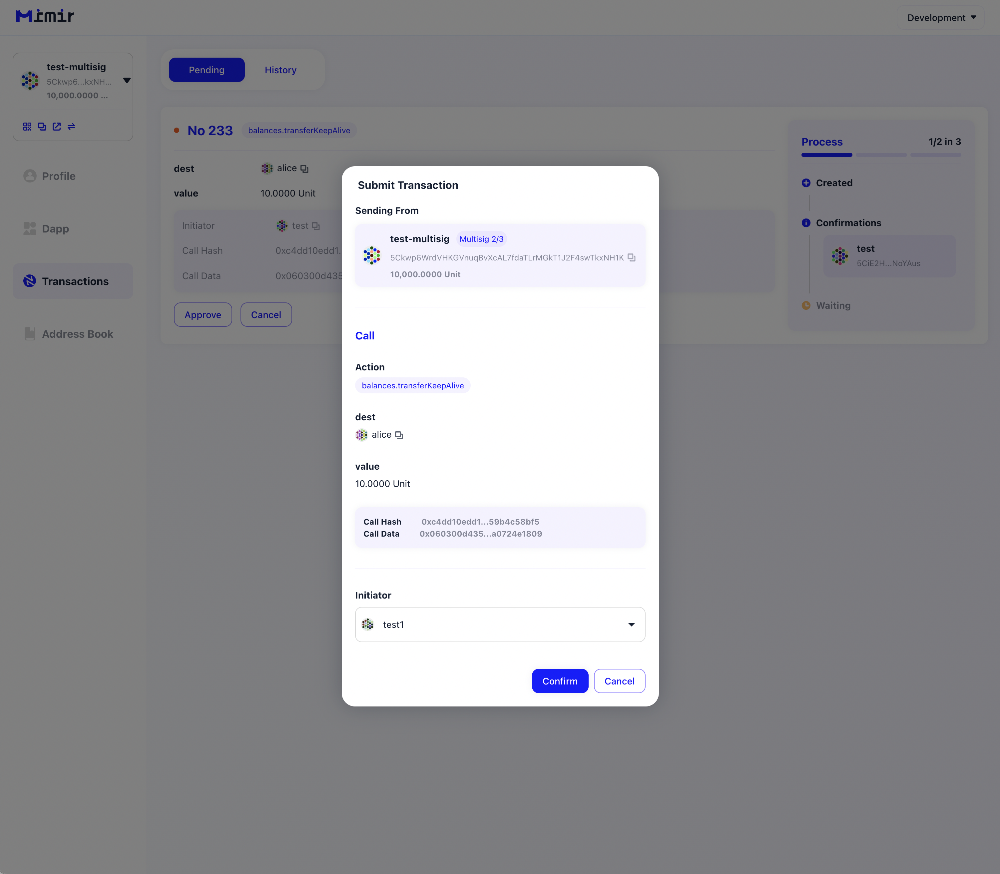

# MIMIR基本流程

1. 初始化页面

2. 创建多签账户

3. 多签账户创建成功

4. 使用多签账户转账

5. 在真正发送交易时，选择多签的其中一个账户签名

6. 多签交易初始化成功，进入等待其他账户批准阶段

7. 切换多签的其他账户进行approve

**注：当多签账户被成功创建后，该多签账户会被同步给所有签名者，此图为另一个签名者打开产品是看到的同步账户**

8. 其他账户批准交易

9. 操作成功！

[Development](../code)