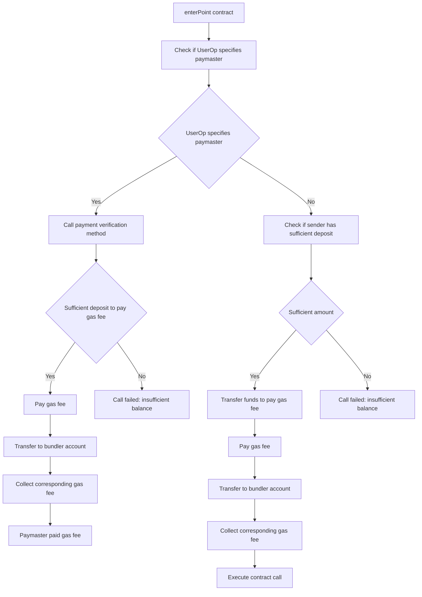

- Project Background/Motivation/Problem to Solve

When users conduct blockchain transactions or execute smart contracts, they need to pay a certain amount of gas fees to cover the cost of network processing resources. However, for some users, paying these gas fees can become a burden, especially when they need to conduct transactions or execute smart contracts frequently. The Gas fee payment feature proposed by the Polkadot Smart Account project can pay for users' transaction gas fees, so they do not have to pay extra fees for executing transactions. This feature can significantly reduce the transaction costs of users using our platform, improve user participation and user experience.
In addition, our project aims to solve some of the problems with the current account management methods in the Polkadot ecosystem, such as users may lose access to their accounts or assets due to forgotten or leaked passwords, lost or stolen mnemonics and private keys. By implementing an account abstraction based on ERC-4337 and recovery account function through multi-sig, we can help users quickly recover their accounts when they lose access to them, thereby protecting their asset security. Additionally, our account management method is more convenient and secure, which will bring better user experience for users in the Polkadot ecosystem.

- Project Introduction

EIP4337 is currently one of the most important tracks in the Ethereum ecosystem, which replaces EOA public key addresses with smart contract accounts to achieve scalability of account logic, making advanced features such as third-party gas fee payment, social account login, social recovery, and batch transactions possible. Polkadot Smart Account is an implementation of smart contract accounts in the Polkadot ecosystem, based on the ink! contract and adjusted and optimized according to the Polkadot architecture, following the EIP4337 standard, and will also provide a pallet version in the future.
Polkadot Smart Account is a project for account abstraction based on the Polkadot ecosystem. Our goal is to provide a more convenient and secure account management method for users in the Polkadot ecosystem. Our project will focus on the recovery account function through multi-sig to improve users' recovery ability when they lose access to their accounts. In addition, we also plan to integrate Passkey technology in future versions, which is the encryption key built into users' mobile phones and computers, and users can directly manage account assets by using fingerprint unlocking, further improving the user experience while ensuring security.

- Project Demo
N/A
- Technical Architecture

- Project Logo (if any), which will be printed on publicity materials, venue posters, or stickers.

- The initial commit of the project, for a brand new project, it can be a clone of an open-source framework, such as clone of substrate-node-template for blockchain, react framework, etc., please provide an explanation. For mature projects, it can be a branch, which must be generated after May 12, 2023, and explain what functions are already available.
<https://github.com/pnsproject/ink-aa/commit/7e712fb607b5dfb4a2816a8036cf40e3e395486d>
The ink! command-line tool was used to initialize the project.
