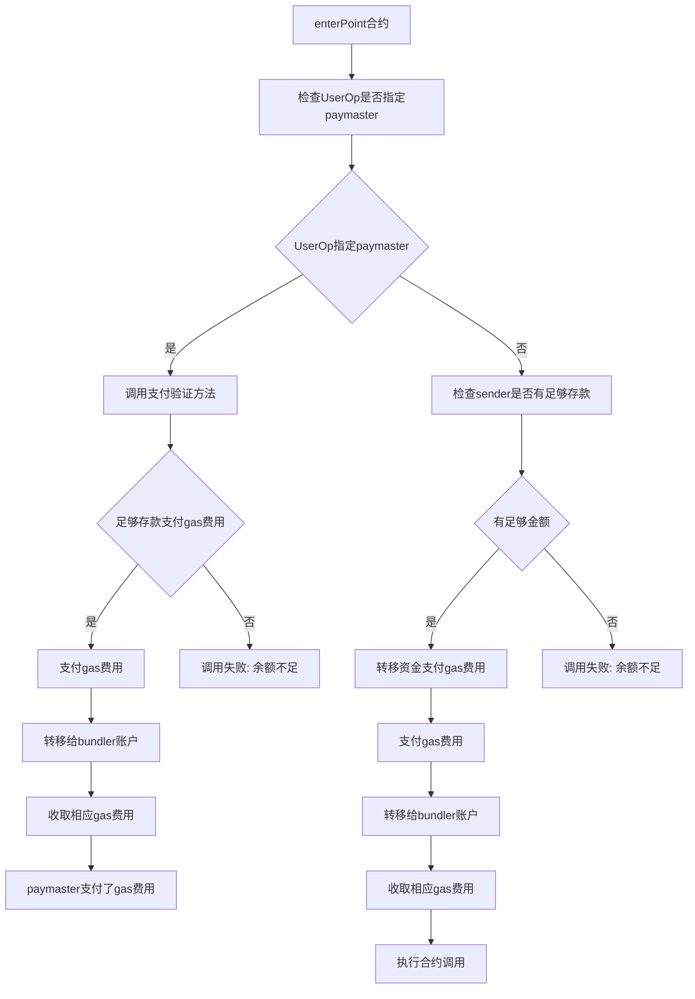

## 基本资料

项目名称：Polkadot Smart Account

项目立项日期 (哪年哪月)：2023年6月

## 项目整体简介

项目简介，英文提交。包括但不限于：

- 项目背景/原由/要解决的问题 (如有其他附件，可放到 `docs` 目录内。英文提交)。

当用户在进行区块链交易或执行智能合约时，需要支付一定的Gas费用来支付网络处理交易所需的计算资源。然而，对于一些用户来说，支付这些Gas费用可能会成为一个负担，尤其是当他们需要频繁地进行交易或执行智能合约时。Polkadot Smart Account项目提出的Gas费用代付功能，可以为用户支付他们的交易Gas费用，这样他们就不必为执行交易而支付额外的费用了。这个功能可以显著降低用户使用我们的平台的交易成本，提高用户的参与度和使用体验。
此外，我们的项目还旨在解决波卡生态中当前的账户管理方式存在的一些问题，例如用户可能会因为密码遗忘或泄露、助记词和私钥丢失或被盗等原因无法访问其账户或资产丢失。通过实现基于ERC-4337的账户抽象和社交恢复账号功能，我们可以帮助用户在丢失账户访问权限时快速恢复账户，从而保护用户的资产安全。此外，我们的账户管理方式更加便捷、安全，将为波卡生态中的用户带来更好的使用体验。

- 项目介绍

EIP4337  是目前以太坊生态最重要的赛道之一，用智能合约账户替代 EOA 公钥地址，实现账户逻辑的可扩展性，使第三方支付 gas fee、社交账户登录、社交恢复、批量交易等高级功能成为可能。Polkadot Smart Account 是  Polkadot  生态的智能合约账户实现，参考 EIP4337 标准，基于  ink! 合约，根据 Polkadot 的架构进行调整和优化，未来也将提供  pallet  版本的实现。
Polkadot Smart Account是一个基于波卡生态的账户抽象项目。我们的目标是为波卡生态中的用户提供更加便捷、安全的账户管理方式。我们的项目将侧重于社交恢复账号的功能，以提高用户在丢失账户访问权限时的恢复能力。此外，我们还计划在未来的版本中集成Passkey技术，即用户手机和电脑中内置的加密密钥，用户可以使用指纹解锁直接管理账户资产，以进一步提高用户的使用体验，同时保障安全性。

- 项目Demo
暂无
- 技术架构



- 项目 logo (如有)，这 logo 会印制在文宣，会场海报或贴子上。


- 项目的启始的commit，对于全新的项目可以是一个开源框架的clone，比如区块链clone自substrate-node-template, react
框架等，请给出说明。对于成熟项目可以是一个branch，要求在2023年5月12号之后生成，说明有哪些功能是已经有了的
<https://github.com/pnsproject/ink-aa/commit/7e712fb607b5dfb4a2816a8036cf40e3e395486d>
使用ink!的命令行工具来初始化项目。

## 黑客松期间计划完成的事项

- [ ] 可以恢复账号
- [ ] gas费代付

## 黑客松期间所完成的事项 (2023年7月4日上午11:59初审前提交)

- 2023年7月4日上午11:59前，在本栏列出黑客松期间最终完成的功能点。
gas费代付
- 把相关代码放在 `src` 目录里，并在本栏列出在黑客松期间完成的开发工作及代码结构。我们将对这些目录/档案作重点技术评审。

```tree
.
├── Cargo.lock
├── Cargo.toml
├── contracts
│   ├── base_account
│   │   ├── Cargo.toml
│   │   └── lib.rs
│   ├── base_paymaster
│   │   ├── Cargo.toml
│   │   └── lib.rs
│   ├── entry_point
│   │   ├── Cargo.toml
│   │   └── lib.rs
│   ├── nonce_manager
│   │   ├── Cargo.toml
│   │   └── lib.rs
│   ├── sender_creator
│   │   ├── Cargo.toml
│   │   └── lib.rs
│   └── stake_manager
│       ├── Cargo.toml
│       └── lib.rs
├── core
│   ├── env.rs
│   ├── exec.rs
│   ├── helpers.rs
│   ├── mod.rs
│   └── user_operation.rs
├── lib.rs
└── traits
    ├── account.rs
    ├── aggregator.rs
    ├── entry_point.rs
    ├── mod.rs
    ├── nonce_manager.rs
    ├── paymaster.rs
    └── stake_manager.rs
```

## 队员信息

1. Jiang - 区块链开发者，精通 Solidity, 对 ERC-4337 标准有深入了解。<https://github.com/jiangplus>
2. Cupnfish - 区块链开发者，拥有多年的区块链开发经验，擅长使用智能合约和区块链技术进行开发, 擅长Rust。<https://github.com/Cupnfish>
